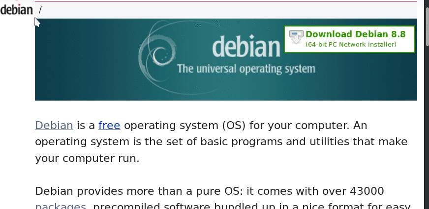

<div align="center">
  <p>
    <h1>
      <a href="https://github.com/lupoDharkael/flameshot">
        
      </a>
      <br />
      Flameshot
    </h1>
    <h4>Powerful yet simple to use screenshot software.</h4>
  </p>
  <p>
    <a href="https://travis-ci.org/lupoDharkael/flameshot">
      
    </a>
    <a href="https://ci.appveyor.com/project/lupoDharkael/flameshot">
      
    </a>
    <a href="https://github.com/lupoDharkael/flameshot/releases">
      
    </a>
    <a href="https://github.com/lupoDharkael/flameshot/releases">
      
    </a>
    <a href="https://github.com/lupoDharkael/flameshot/blob/master/LICENSE">
      
    </a>
    <a href="https://github.com/flameshotapp/flameshotapp.github.io">
      
    </a>
  </p>
</div>


## Preview



## Index

- [Features](#features)
- [Usage](#usage)
  - [CLI configuration](#cli-configuration)
- [Keyboard Shortcuts](#keyboard-shortcuts)
  - [Local](#local)
  - [Global](#global)
    - [On KDE Plasma desktop](#on-kde-plasma-desktop)
- [Considerations](#considerations)
- [Installation](#installation)
- [Compilation](#compilation)
  - [Dependencies](#dependencies)
    - [Compile-time](#compile-time)
    - [Run-time](#run-time)
    - [Optional](#optional)
    - [Debian](#debian)
    - [Fedora](#fedora)
    - [Arch](#arch)
  - [Build](#build)
  - [Install](#install)
- [Packaging](#packaging)
- [License](#license)
- [Contribute](#contribute)
- [Donations](#donations)
- [Acknowledgment](#acknowledgment)

## Features

- Customizable appearance.
- Easy to use.
- In-app screenshot edition.
- DBus interface.
- Upload to Imgur.

## Usage

Example commands:

- Capture with GUI:

    ```shell
    flameshot gui
    ```

- Capture with GUI with custom save path:

    ```shell
    flameshot gui -p ~/myStuff/captures
    ```

- Open GUI with a delay of 2 seconds:

    ```shell
    flameshot gui -d 2000
    ```

- Fullscreen capture with custom save path (no GUI) and delayed:

    ```shell
    flameshot full -p ~/myStuff/captures -d 5000
    ```

- Fullscreen capture with custom save path copying to clipboard:

    ```shell
    flameshot full -c -p ~/myStuff/captures
    ```

- Capture the screen containing the mouse and print the image (bytes) in PNG format:

    ```shell
    flameshot screen -r
    ```

- Capture the screen number 1 and copy it to the clipboard:

    ```shell
    flameshot screen -n 1 -c
    ```

In case of doubt choose the first or the second command as shortcut in your favorite desktop environment.

A systray icon will be in your system's panel while Flameshot is running.
Do a right click on the tray icon and you'll see some menu items to open the configuration window and the information window.
Check out the information window to see all the available shortcuts in the graphical capture mode.

### CLI configuration

You can use the graphical menu to configure Flameshot, but alternatively you can use your terminal or scripts to do so.

- Open the configuration menu:

    ```shell
    flameshot config
    ```

- Show the initial help message in the capture mode:

    ```shell
    flameshot config --showhelp true
    ```

- For more information about the available options use the help flag:

    ```shell
    flameshot config -h
    ```

## Keyboard shortcuts

### Local

These shortcuts are available in GUI mode:

|  Keys                                                                     |  Description                                                   |
|---                                                                        |---                                                             |
| <kbd>←</kbd>, <kbd>↓</kbd>, <kbd>↑</kbd>, <kbd>→</kbd>                    | Move selection 1px                                             |
| <kbd>Shift</kbd> + <kbd>←</kbd>, <kbd>↓</kbd>, <kbd>↑</kbd>, <kbd>→</kbd> | Resize selection 1px                                           |
| <kbd>Esc</kbd>                                                            | Quit capture                                                   |
| <kbd>Ctrl</kbd> + <kbd>C</kbd>                                            | Copy to clipboard                                              |
| <kbd>Ctrl</kbd> + <kbd>S</kbd>                                            | Save selection as a file                                       |
| <kbd>Ctrl</kbd> + <kbd>Z</kbd>                                            | Undo the last modification                                     |
| <kbd>Spacebar</kbd>                                                       | Toggle visibility of sidebar with options of the selected tool, color picker for the drawing color and history menu |
| Right Click                                                               | Show the color wheel                                              |
| Mouse Wheel                                                               | Change the tool's thickness                                    |

<kbd>Shift</kbd> + drag a handler of the selection area: mirror redimension in the opposite handler.

### Global

If you want use Flameshot as a default screenshot utility, chances are you want to launch it using the <kbd>Prt Sc</kbd> key. Flameshot doesn't yet offer a fully-automated option to do so, but you can configure your system to do so.

#### On KDE Plasma desktop

To make configuration easier, there's a [file](docs/shortcuts-config/flameshot-shortcuts-kde) in the repository that more or less automates this process. This file will assign the following keys to the following actions by default:

|  Keys                                                  |  Description                                                                       |
|---                                                     |---                                                                                 |
| <kbd>Prt Sc</kbd>                                      | Start the Flameshot screenshot tool and take a screenshot                          |
| <kbd>Ctrl</kbd> + <kbd>Prt Sc</kbd>                    | Wait for 3 seconds, then start the Flameshot screenshot tool and take a screenshot |
| <kbd>Shift</kbd> + <kbd>Prt Sc</kbd>                   | Take a full-screen (all monitors) screenshot and save it                           |
| <kbd>Ctrl</kbd> + <kbd>Shift</kbd> + <kbd>Prt Sc</kbd> | Take a full-screen (all monitors) screenshot and copy it to the clipboard          |

If you don't like the defaults, you can change them manually later.

Steps for using the configuration:

1. The configuration file configures shortcuts so that Flameshot automatically saves (without opening the save dialog) screenshots to `~/Pictures/Screenshots` folder. Make sure you have that folder by running the following command:

    ```shell
    mkdir -p ~/Pictures/Screenshots
    ```

    (If you don't like the default location, you can skip this step and configure your preferred directory later.)
2. Download the configuration file:

    ```shell
    cd ~/Desktop
    wget https://raw.githubusercontent.com/lupoDharkael/flameshot/master/docs/shortcuts-config/flameshot-shortcuts-kde
    ```
3. Go to _System Settings_ → _Shortcuts_ → _Custom Shortcuts_.
4. If there's one, you'll need to disable an entry for Spectacle, the default KDE screenshot utility first because its shortcuts might collide with Flameshot's ones; so, just uncheck the _Spectacle_ entry.
5. Click _Edit_ → _Import..._, navigate to the Desktop folder (or wherever you saved the configuration file) and open the configuration file.
6. Now the Flameshot entry should appear in the list. Click _Apply_ to apply the changes.
7. If you want to change the defaults, you can expand the entry, select the appropriate action and modify it as you wish; the process is pretty mush self-explanatory.

## Considerations

- Experimental Gnome Wayland and Plasma Wayland support.

- If you are using Gnome you need to install the [Gnome Shell Extension Appindicator](https://github.com/Ubuntu/gnome-shell-extension-appindicator) extension in order to see the systemtray icon.

- In order to speed up the first launch of Flameshot (DBus init of the app can be slow), consider starting the application automatically on boot.

- Press <kbd>Enter</kbd> or <kbd>Ctrl</kbd> + <kbd>C</kbd> when you are in a capture mode and you don't have an active selection and the whole desktop will be copied to your clipboard! Pressing <kbd>Ctrl</kbd> + <kbd>S</kbd> will save your capture in a file! Check the [Shortcuts](#shortcuts) for more information.

- Execute the command `flameshot` without parameters to launch a running instance of the program without taking actions.

## Installation

There are packages available for a few distros:

- [Arch](https://www.archlinux.org/packages/community/x86_64/flameshot/): `pacman -S flameshot`
  + Snapshot also available via AUR: [flameshot-git](https://aur.archlinux.org/packages/flameshot-git).
- [Debian 10+](https://tracker.debian.org/pkg/flameshot): `apt install flameshot`
  + Package for Debian 9 ("Stretch") also [available via stretch-backports](https://backports.debian.org/).
- [Ubuntu 18.04+](https://launchpad.net/ubuntu/+source/flameshot): `apt install flameshot`
- [openSUSE](https://software.opensuse.org/package/flameshot)
- [Void Linux](https://github.com/void-linux/void-packages/tree/master/srcpkgs/flameshot) (`xbps-install flameshot`)
- [Docker](https://github.com/ManuelLR/docker-flameshot)
- Fedora: `dnf install flameshot`
- [Snap/Flatpak/AppImage](https://github.com/flameshotapp/packages)
- Besides, generic packages available via [opensuse software repository](https://software.opensuse.org//download.html?project=home%3AVitzy&package=flameshot)

<details>
  <summary>Expand this section to see what distros are using an up to date version of flameshot</summary>
  <a href="https://repology.org/metapackage/flameshot/versions">
    
  </a>
</details>

## Compilation

To build the application in your system, you'll need to install the dependencies needed for it and Package names might be different for each distribution, see [Dependencies](#dependencies) below for more information.

### Dependencies

#### Compile-time

- Qt >= 5.3
  + Development tools
- GCC >= 4.9.2

#### Run-time

- Qt
  + SVG

#### Optional

- Git
- OpenSSL
- CA Certificates

#### Debian

```shell
# Compile-time
apt install g++ build-essential qt5-default qt5-qmake qttools5-dev-tools

# Run-time
apt install libqt5dbus5 libqt5network5 libqt5core5a libqt5widgets5 libqt5gui5 libqt5svg5-dev

# Optional
apt install git openssl ca-certificates
```

#### Fedora

```shell
# Compile-time
dnf install gcc-c++ qt5-devel qt5-qtbase-devel qt5-linguist

# Run-time
dnf install qt5-qtbase qt5-qtsvg-devel

# Optional
dnf install git openssl ca-certificates
```

#### Arch

```shell
# Compile-time
pacman -S base-devel git qt5-base qt5-tools

# Run-time
pacman -S qt5-svg

# Optional
pacman -S openssl ca-certificates
```

### Build

After installing all the dependencies, finally run the following commands in the sources root directory:

```shell
mkdir build
cd build
qmake ../
make
```

### Install

Simply use `make install` with privileges.

## Packaging

Having `git` installed is required if you're building Flameshot from a snapshot to have precise version information.

In order to generate the instructions in the `Makefile` to install the application in `/usr` instead of in `/usr/local` you can pass the `packaging` option to `qmake` (`qmake CONFIG+=packaging`).

If you want to install in a custom directory you can use the `INSTALL_ROOT` variable.

**Example**:

If you want to install Flameshot in `~/myBuilds/test`, you can execute the following to do so:

```shell
qmake CONFIG+=packaging
make INSTALL_ROOT=~/myBuilds/test install
```

## License
- The main code is licensed under [GPLv3](LICENSE)
- The logo of Flameshot is licensed under [Free Art License v1.3](img/app/flameshotLogoLicense.txt)
- The button icons are licensed under Apache License 2.0. See: https://github.com/google/material-design-icons
- The code at capture/capturewidget.cpp is based on https://github.com/ckaiser/Lightscreen/blob/master/dialogs/areadialog.cpp (GPLv2)
- The code at capture/capturewidget.h is based on https://github.com/ckaiser/Lightscreen/blob/master/dialogs/areadialog.h (GPLv2)
- I copied a few lines of code from KSnapshot regiongrabber.cpp revision `796531` (LGPL)
- Qt-Color-Widgets taken and modified from https://github.com/mbasaglia/Qt-Color-Widgets (see their license and exceptions in the project) (LGPL/GPL)

Info: If I take code from your project and that implies a relicense to GPLv3, you can reuse my changes with the original previous license of your project applied.

## Contribute

If you want to contribute check the [CONTRIBUTING.md](CONTRIBUTING.md)

## Donations
I improve Flameshot in my free time because I want to create something good for everyone to use. 
If you want you can donate some bucks with the following options: 
- [Paypal](https://www.paypal.me/lupoDharkael)
- bitcoin:1K6oiUKWVjP3x9ZuW9C7NbDfcFkMx3G8ue


## Acknowledgment
I really appreciate those who have shown interest in the early development process:
- [Cosmo](https://github.com/philpem)
- [XerTheSquirrel](https://github.com/XerTheSquirrel)
- [The members of Sugus GNU/Linux](https://github.com/SUGUS-GNULinux)
- ismatori
