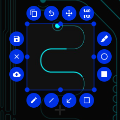
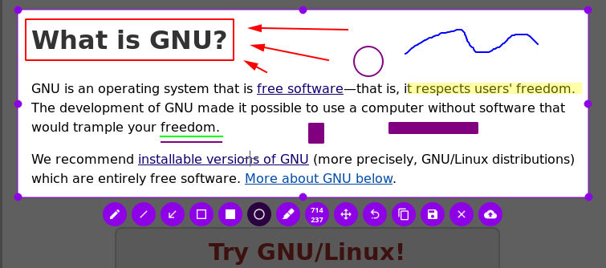

> Powerfull yet simple to use screenshot software.

**A beta will be released and packaged for the main GNU/Linux distros soon !**

## Usage

Add `flameshot-cli` to be executed as a shortcut. When you press the assigned key, Flameshot will be launched in the capture mode.

A systray icon will be added to your panel after the first execution of Flameshot.

Do a right click on the tray icon and you'll see some menu items to open the configuration window and the information window.
Check out the information window to see all the available shortcuts in the capture mode.

## Considerations

**Not working on Wayland**

If you are using Gnome you need to install the [TopIcons](https://extensions.gnome.org/extension/495/topicons/) extension in order to see the systemtray icon.

This software is very focused on selection capture and edition, but you can do full screen captures very easily just not having a visible selection, by default it will take it as if you were selecting the whole screen.

Check the ./docs folder for more information.

## Screenshots
Dynamic button position based on your selection!

Choose your buttons and edit your screenshots!

## License
- The main code is licensed under GPLv3
- The logo of Flameshot is licensed under Free Art License v1.3
- The button icons are licensed under Apache License 2.0. See: https://github.com/google/material-design-icons
- The code at capture/capturewidget.cpp is based on https://github.com/ckaiser/Lightscreen/blob/master/dialogs/areadialog.cpp (LGPL/GPL)
- The code at capture/capturewidget.h is based on https://github.com/ckaiser/Lightscreen/blob/master/dialogs/areadialog.h (LGPL/GPL)
- Qt-Color-Widgets taken and modified from https://github.com/mbasaglia/Qt-Color-Widgets (see their license and exceptions in the project) (LGPL/GPL)

## Acknowledgment
I really appreciate those who have shown interest in the develpment process:
- Cosmo.
- ismatori.
- The members of the Sugus GNU/Linux association.
