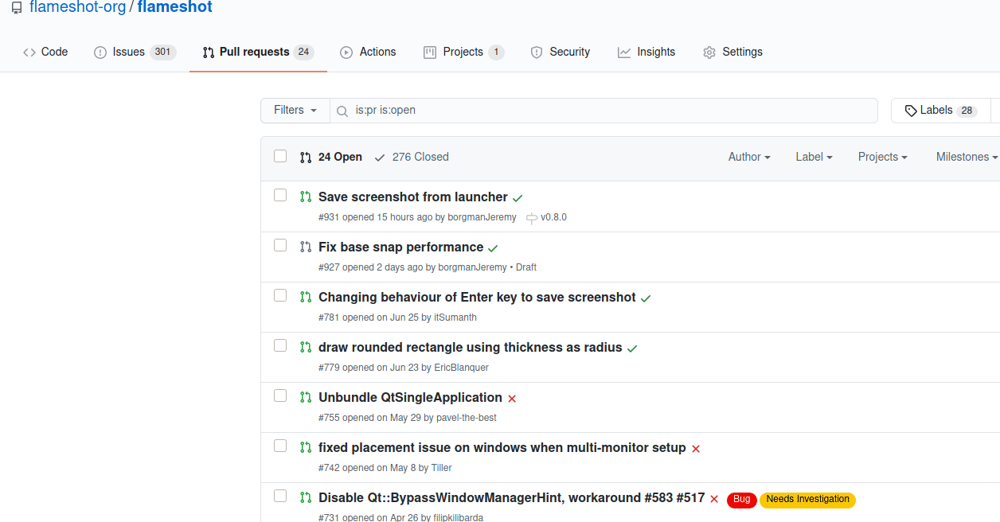
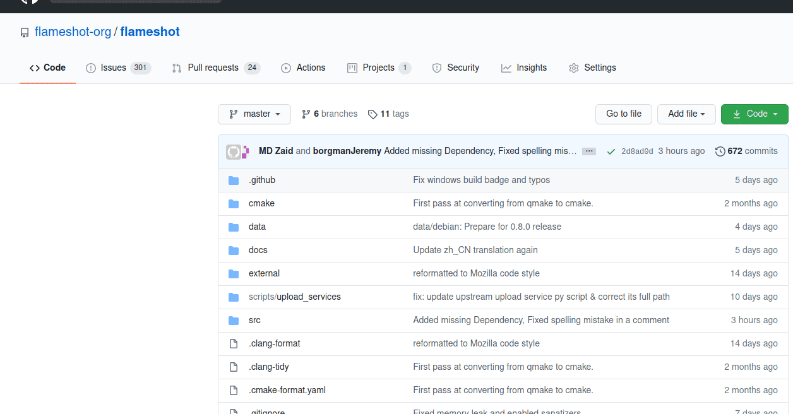

# 0.8 Release Notes
Thanks to all the testers and contributors that helped make version 0.8! We are very excited to have improved many bugs and added new features in version 0.8.

## Known Issues
* Wayland support is experimental. In generic packages (Snap, Flatpak, AppImage) there may be extra issues with Wayland.
* In generic packages(Snap, Flatpak, AppImage) due to confinement "Open With External Application" does not work.
* If "close after capture" is enabled, and a user copies the image to clipboard, the image may not actually be in the clipboard. We recommend using the "Save" feature with close after capture.

## New Features
* Fix capture after pressing ctrl + S during textarea input (#311)
* Add translation:
    - Japanese (#361)
    - Brazilian Portuguese (#364)
    - Serbian (#376)
    - Dutch (#440)
    - Ukrainian (#464)
    - German (#467)
    - Slovak (#525)
    - Basque
    - Czech
    - Swedish
    - Italian
    - Korean
    - Dutch
* Allow enter key to copy image to clipboard (#362)
* side panel: Add thickness slider (#374)
* Add support for saving as JPG and BMP files. (#436)
* Allow 45 degree adjustment for some tools (#439)
* Add option to close after capture (WARNING: this function is buggy! It may not work well if you are going to copy the image to clipboard! If you encounter problems related to clipboard, please disable this feature in the configuration and try again. This is a known bug, see #557 and #569 .)
* Add a basic launcher panel.
* Add option to auto copy URL after upload (#553)
* Add a circle counter tool.
* Replace the blur tool with pixelate tool.
* Convert buildsystem from QMake to CMake.
* Add launcher action into .desktop file.
* Added Generic Packages (Snap, Flatpak, AppImage)
* Improved Windows support

## Preview of New Features

### Pixelate
The behavior of the blur tool has been modified so if the "thickness" is 0 or 1, the old blur behavior is preserved. If the thickness is increased past 1 the image will pixelate by the thickness:

### Countertool
A popular request has been to add a tool that counts upward. This can be helpful when creating directions.

### Sidebar
A button has been added to open the sidebar. This tool was previously only accessible by hitting "Spacebar" which made usage on tablets difficult. This sidebar allows advanced modifications for many tools.

## Fixes
* Exit non-zero when aborting with --raw. (#424)
* Enable Pin and Text tool by default. (#443)
* Fix the problem that moving or resizing does not affect screenshot. (#459)
* Fix problem with re-enabling disabled tray icon (#495)
* Fix compilation problem against Qt 5.15.
