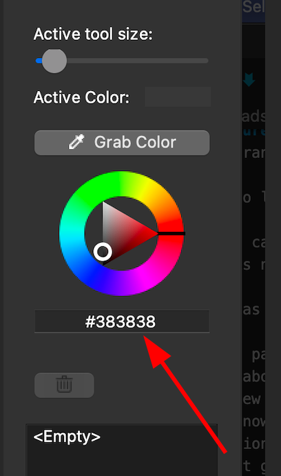

# V11.0 Beta

This is the BETA release for version 11. As you will see below there were major refactorings to the internals of Flameshot. We did our best internal testing, but this particular beta is more likely to have issues than most.

We will be in beta for 1-2 weeks depending on what kind of issues are found and then do the official release. 

## New Features
- The on-screen help menu has been clarified and dynamically updates the hotkeys based on user defined hotkeys. 

 

- DBus is no longer required for CLI options.

- Flameshot can now be run in "one off" mode which means the background systray component is now optional. See the CLI details below.

- The CLI has been completely refactored. With the new architecture we added the following:
  - The man page has been rewritten to reflect all the new options. The best place to learn about these new features is the man page or flameshot --help, but some notable new features will be outlined here. 
  - CLI is now callable from MacOS.
  - CLI options are unified wherever possible. This means if an argument is added to "flameshot gui" it is also likely to be supported in "flameshot full".
  - `--region` is a new flag that allows users to specify the exact region to screenshot. It uses the same syntax as xrandr: `WxH+x+y`.
    - This is likely to be added to the launcher in the next release. 
  - `--accept-on-select` This flag will save the image as soon as the mouse is released when selecting a region.
  - The CLI now supports pinning (`--pin`), uploading (`--upload`), and copying to clipboard (`--clipboard`).
    Note that in case one of these options (or `--path`, `--raw` also) is used, an *Accept* button is shown and the *Save*, *Copy*, *Upload*, *Pin*, *Open With* buttons are hidden.

- MacOS now uses monochrome icon to match the system theme better.

 

- The sidebar now shows the hexadecimal color value when the color picker is used:

 

- The about screen lists system information and allows you to copy this for easy access in bug submission forms. 

- Every file format supported by your underlying system is now an option for file format when saving. 

- New tool added to invert a region:

 

- Thickness of tools can now be set with the keyboard. Simply type a numerical value like "15" and you will see the indicator in the upper left.

- New zoom capability has been added to the color picker to more precisely select a color.

 

- Text alignment can now be set in the side bar. 

 

- File names can now contain '.'

- Even if a button is hidden from the toolbar, it can still be activated via hotkey.

- The uploader now gives users a confirmation box before uploading. This can be disabled. **If you disable this and accidentally upload sensitive information, there is nothing we can do. It's recommended to leave the confirmation enabled.** Also, a keyboard shortcut for upload has been enabled (`Ctrl+U` by default)

- MacOS users can now bind a custom hotkey for taking a screenshot. 

- The config file parser has been reworked. It will now alert users if there is an error in their config. If a repair is possible, Flameshot attempts to repair the file. 
  - We do our best not to break existing configs, but sometimes adding new features or removing old ones force this to change. 

- Double clicking can be used to copy the screenshot to the clipboard. 

- Added an option to enable anti-aliasing when zooming in on a pinned image. 

- Added completions for the fish shell

## Bug Fixes 
- The border that indicates an object is moveable is no longer saved or copied with the underlying image. 

- The edit buttons no longer fall in the editable region when there are strange multi monitor geometries. 

- Optimizations to reduce lag on 8k and 4k screens.

- All Qt5 deprecations are fixed in preparation for Qt6.

- Many small UI improvements (ie oversized scrollbars fixed, checkboxes occluded, etc).

- Path handling has been improved.

- Fixed an issue where running Flameshot for the first time on NixOS would fail to create the config file.

- Fixed a problem with some window managers where Flameshot would lose focus and shortcuts would stop working.

## Known Issues
- Fractional scaling on linux is still not resolved.  (But we have identified a workaround finally. Hope to merge soon.)

## Contributors
I want to give special shout outs to some team members that made this release possible. 
- @veracioux for doing most of the refactoring that made this release possible 
- @mmahmoudian for tirelessly doing triage and community management
- @Correct-Syntax for the [redesigned website](https://flameshot.org)

We are very excited by the many first time contributors that helped with this release. We are always looking for more people to contribute to Flameshot and are happy to provide mentorship if needed:

* @johnjago made their first contribution in https://github.com/flameshot-org/flameshot/pull/1779
* @veracioux made their first contribution in https://github.com/flameshot-org/flameshot/pull/1782
* @etircopyh made their first contribution in https://github.com/flameshot-org/flameshot/pull/1799
* @uncomfyhalomacro made their first contribution in https://github.com/flameshot-org/flameshot/pull/1832
* @karlhorky made their first contribution in https://github.com/flameshot-org/flameshot/pull/1845
* @Cr4ckC4t made their first contribution in https://github.com/flameshot-org/flameshot/pull/1849
* @j-tai made their first contribution in https://github.com/flameshot-org/flameshot/pull/1856
* @CrystalSage made their first contribution in https://github.com/flameshot-org/flameshot/pull/1926
* @a1346054 made their first contribution in https://github.com/flameshot-org/flameshot/pull/1918
* @PrSunflower made their first contribution in https://github.com/flameshot-org/flameshot/pull/1582
* @mgalgs made their first contribution in https://github.com/flameshot-org/flameshot/pull/1940
* @GongHeng2017 made their first contribution in https://github.com/flameshot-org/flameshot/pull/1812
* @gVirtu made their first contribution in https://github.com/flameshot-org/flameshot/pull/1981
* @YizhePKU made their first contribution in https://github.com/flameshot-org/flameshot/pull/1979
* @Lyqst made their first contribution in https://github.com/flameshot-org/flameshot/pull/1995
* @AdavisSnakes made their first contribution in https://github.com/flameshot-org/flameshot/pull/1992
* @deo002 made their first contribution in https://github.com/flameshot-org/flameshot/pull/2008
* @Michael-F-Bryan made their first contribution in https://github.com/flameshot-org/flameshot/pull/2012
* @sryze made their first contribution in https://github.com/flameshot-org/flameshot/pull/2026
* @meesha7 made their first contribution in https://github.com/flameshot-org/flameshot/pull/2042
* @majkinetor made their first contribution in https://github.com/flameshot-org/flameshot/pull/2056
* @claytron5000 made their first contribution in https://github.com/flameshot-org/flameshot/pull/2068
* @LHBosssss made their first contribution in https://github.com/flameshot-org/flameshot/pull/2098
* @ffabss made their first contribution in https://github.com/flameshot-org/flameshot/pull/2140
* @reggermont made their first contribution in https://github.com/flameshot-org/flameshot/pull/2150
* @RiedleroD made their first contribution in https://github.com/flameshot-org/flameshot/pull/2130
