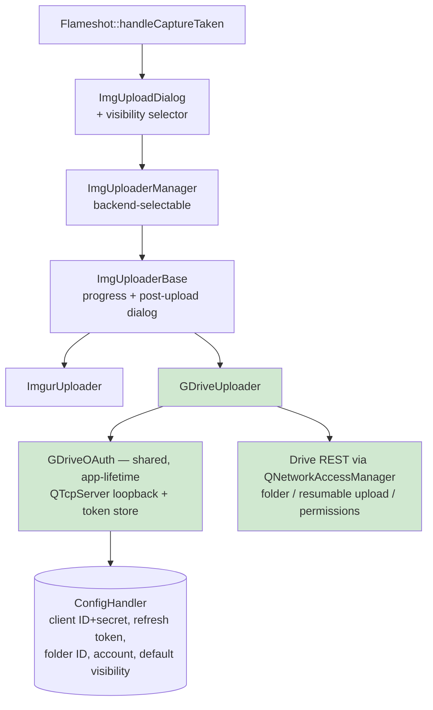
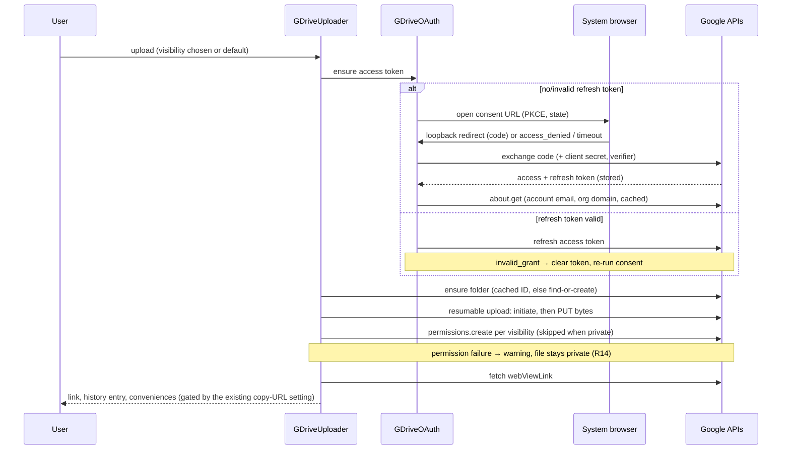
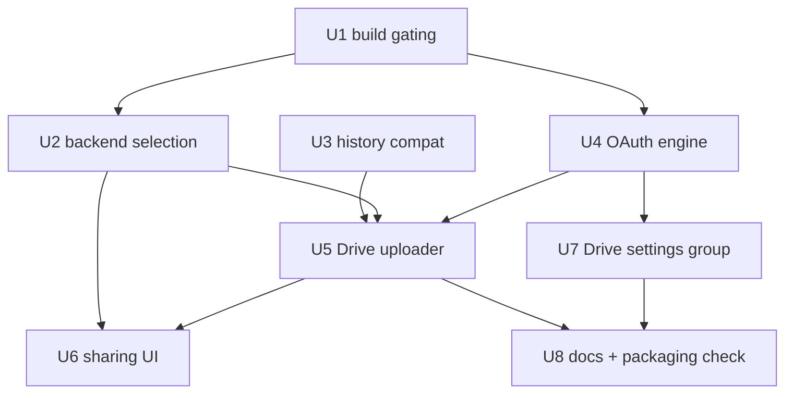

# Google Drive Upload - Plan

## Goal Capsule

- **Objective:** Add Google Drive as a selectable, OAuth-authenticated upload target for private screenshot sharing inside a Google Workspace org, with per-upload and default sharing control and least-privilege single-folder access.
- **Product authority:** This plan owns the Google Drive uploader only. Imgur behavior is unchanged except that the uploader manager becomes backend-selectable and shared upload infrastructure moves behind a backend-neutral build gate.
- **Open blockers:** None — all product forks and the deferred planning questions are resolved; the plan is implementation-ready.
- **Stop conditions:** Surface instead of guessing if Google's flow deviates from the recorded mechanics (e.g., the org's Desktop client is not issued a client secret), if the test org's Workspace policy blocks the org-link sharing default, or if decoupling the shared upload guards from `ENABLE_IMGUR` breaks the Imgur-only build.

---

## Product Contract

### Summary

Flameshot gains Google Drive as an upload target selectable in settings alongside Imgur. A Workspace user authorizes once over OAuth (system-browser consent via loopback redirect), then each capture uploads into a single fixed-name folder on their own Drive and returns a shareable link. Visibility is chosen per-upload from four levels and backed by a configurable default, and the app is confined by a least-privilege scope to the files it creates. The implementation adds a Drive storage backend behind the generalized uploader manager, a hand-rolled loopback OAuth engine on the already-linked Qt networking stack, per-upload sharing in the existing upload confirmation dialog, and Drive-safe history packing — all under a new `ENABLE_GDRIVE` build option.

### Problem Frame

Flameshot today has exactly one remote upload target, Imgur, and its uploader manager hard-codes that choice. For an organization on Google Workspace, Imgur is the wrong destination: captures often contain internal information that should stay inside the domain, and there is no path to share a screenshot privately with a colleague through infrastructure the org already trusts and governs. Teams end up saving files manually and uploading them to Drive by hand, which is slow and breaks the capture-and-share flow that makes Flameshot useful. The org already runs Workspace and can register its own OAuth application, so the missing piece is a first-class Drive uploader that respects the org's trust boundary and the sensitivity of what gets captured.

### Key Decisions

- KD1. Bring-your-own org-internal OAuth client ID; nothing shipped in the binary. (session-settled: user-directed — chosen over a Flameshot-shipped public client: keeps authorization inside the org's Google Cloud trust boundary and avoids Google restricted-scope app verification.) Governs R1.
- KD2. Google Drive is a settings-selectable upload target alongside Imgur, not a replacement. (session-settled: user-directed — chosen over replacing Imgur or adding a separate action: generalizes the currently Imgur-hardcoded manager.) Governs R11.
- KD3. Uploads are confined to a single constant-named folder in the user's own My Drive, enforced by the least-privilege `drive.file` scope. (session-settled: user-directed — chosen over broader Drive access: the app cannot list or reach anything outside what it created, including shared drives.) Governs R5, R6, R7.
- KD4. Default visibility is "anyone in the org with the link". (session-settled: user-directed — chosen over private-by-default: optimizes the common internal-share path, accepting that captures are org-readable by default.) Governs R9.
- KD5. The OAuth refresh token is stored in Flameshot's existing plaintext config. (session-settled: user-directed — chosen over the OS keychain: simplest and consistent with current storage; blast radius is limited by KD3's least-privilege scope.) Governs R3.
- KD6. OAuth uses the loopback-redirect flow with the system browser. (session-settled: user-approved — chosen over manual code copy-paste: least friction for desktop Workspace users; copy-paste fallback is deferred.) Governs R2.

### Requirements

**Authentication and credentials**

- R1. Flameshot authenticates to Google Drive using OAuth 2.0 with PKCE, with the OAuth client ID and client secret supplied via user/admin-editable config fields (mirroring the existing Imgur Client ID setting) rather than compiled into the binary. Google issues and requires a client secret for Desktop-type clients even with PKCE; like the ID, it is not treated as confidential.
- R2. When there are no valid stored credentials, an upload triggers interactive consent: Flameshot opens the system browser to Google's consent screen and completes authorization via a loopback (`127.0.0.1`) redirect.
- R3. The OAuth refresh token is persisted in Flameshot's existing config so the user is not re-prompted each session.
- R4. When the stored token is missing, revoked, or expired beyond refresh, the next upload re-initiates consent rather than failing silently.

**Upload and storage**

- R5. All uploads are written to a single Drive folder named "Flameshot screenshots" — a constant name identical for every user — located in the authenticated user's own My Drive.
- R6. Flameshot finds the existing "Flameshot screenshots" folder or creates it on first use, without prompting the user to choose a location.
- R7. Flameshot cannot list or access any file outside the "Flameshot screenshots" folder and has no access to shared/Team Drives, enforced by requesting the least-privilege `drive.file` OAuth scope (app-created files only), not by app-side filtering alone.

**Sharing**

- R8. Each upload's visibility is selectable at upload time from four levels: anyone in the org with the link; private (uploader only); specific people by email; anyone with the link (public).
- R9. A configurable default visibility applies unless overridden per-upload; the shipped default is "anyone in the org with the link".
- R10. Selecting "specific people by email" presents an input step to enter one or more recipient identities (individuals or groups) before the upload completes. This level is available from day one.

**Target selection and result**

- R11. The active upload service (Imgur or Google Drive) is selectable in Flameshot settings, and the single upload action routes to the selected service. This generalizes the currently Imgur-hardcoded uploader manager to honor a configured backend.
- R12. After a successful upload, Flameshot returns the file's shareable link and applies the same post-upload conveniences as the existing uploader (copy-URL-after-upload, upload confirmation, upload history) rather than introducing a separate result path.

**Robustness and account control**

- R13. The existing delete controls (post-upload dialog and upload history rows) work for Drive entries: deleting removes the file from Drive so the link stops resolving, then removes the history entry.
- R14. If applying the chosen sharing level fails (e.g., blocked by Workspace admin policy), the upload still counts as success: the file stays private as created, the user gets an explicit warning naming the sharing failure, and the link is still returned. The file is never auto-deleted.
- R15. The authorization wait is bounded and cancelable: the upload UI offers cancel while waiting for browser consent, the loopback listener times out with a clear error, and only one consent flow runs at a time — an upload triggered while consent is pending waits for that flow's outcome instead of starting a second one.
- R16. The Drive settings area shows which Google account is connected and provides a disconnect action that clears stored credentials; the next upload re-initiates consent.

### Key Flows

- F1. First-time authorization
  - **Trigger:** User triggers an upload with Google Drive as the active target and no valid stored credentials.
  - **Steps:** Flameshot opens the system browser to Google consent; user approves; loopback redirect returns the auth code; Flameshot exchanges it for tokens and stores the refresh token; the upload proceeds.
  - **Outcome:** User is authorized; later uploads skip consent.
  - **Covers R1, R2, R3.**
- F2. Upload with default sharing
  - **Trigger:** An authorized user uploads a capture without changing sharing.
  - **Steps:** Find-or-create the "Flameshot screenshots" folder; upload the file into it; apply the default visibility; return the shareable link; apply the post-upload conveniences.
  - **Outcome:** File is in the folder, shared per the default, and the link is available to the user.
  - **Covers R5, R6, R9, R12.**
- F3. Upload with per-upload sharing override
  - **Trigger:** The user selects a non-default sharing level for this upload.
  - **Steps:** User picks a level; for "specific people by email", enters recipients; the file uploads; the chosen visibility is applied; the link is returned.
  - **Outcome:** The file is shared at the chosen level.
  - **Covers R8, R10.**

### Acceptance Examples

- AE1. **Covers R2.** **Given** no stored token, **When** the user uploads to Drive, **Then** the system browser opens for consent before any file is created.
- AE2. **Covers R4.** **Given** a revoked or expired-beyond-refresh token, **When** the user uploads, **Then** consent re-initiates rather than the upload failing silently.
- AE3. **Covers R6.** **Given** the "Flameshot screenshots" folder already exists from a prior session, **When** the user uploads, **Then** the file is placed in the existing folder and no duplicate folder is created.
- AE4. **Covers R7.** **Given** the app is authorized, **When** it operates, **Then** it cannot enumerate or open any Drive file it did not create, and cannot access shared drives.
- AE5. **Covers R9.** **Given** the user has not changed the default, **When** they upload, **Then** visibility is "anyone in the org with the link".
- AE6. **Covers R10.** **Given** the user selects "specific people by email", **When** they proceed, **Then** they are prompted for recipients and the file is shared only to those recipients.
- AE7. **Covers R14.** **Given** Workspace policy blocks the chosen sharing level, **When** the user uploads, **Then** the file is uploaded and stays private, a warning names the sharing failure, and the link is still returned.
- AE8. **Covers R13.** **Given** a Drive entry in upload history, **When** the user clicks its delete control, **Then** the file is removed from Drive and the history entry disappears.
- AE9. **Covers R15.** **Given** a consent flow is pending in the browser, **When** the user triggers another upload, **Then** no second browser flow starts and the second upload proceeds once authorization completes.

### Scope Boundaries

- Shared/Team Drives: no access at all, by design (R7).
- Multiple or user-chosen destination folders, and folder renaming: out — a single fixed-name folder only.
- Editing or replacing already-uploaded files: not in scope. Deleting via the existing delete controls is in scope (R13); no other Drive file management.
- Non-Workspace personal Gmail accounts: not the target use case (may function but is unsupported).

**Deferred to Follow-Up Work**

- Manual copy-paste OAuth fallback for environments where the loopback flow cannot run.
- OS keychain token storage (KD5), and optional rclone-style config encryption as a lighter intermediate hardening step.

### Dependencies / Assumptions

- Requires a Google Cloud project with an "Desktop app"-type OAuth client registered by the org — an admin task external to Flameshot (documented by U8).
- Confirmed at planning: `drive.file` is a non-sensitive scope, and an Internal-type Workspace app skips Google verification entirely. Internal apps are also not subject to the 7-day testing-mode refresh-token expiry.
- Uploaded files count against the authenticated user's own Drive storage quota.
- Assumes the client has network access to Google APIs; on Windows, HTTPS requires the existing optional OpenSSL build dependency.

### Sources / Research

Repo:

- `src/tools/imgupload/imguploadermanager.cpp` — uploader manager; hard-codes Imgur today and contains the maintainers' TODO sketch of exactly the backend-switch shape R11 needs.
- `src/tools/imgupload/storages/imguploaderbase.h` / `.cpp` — abstract uploader widget; two pure virtuals (`upload()`, `deleteImage()`), signals `uploadOk`/`deleteOk`, and the whole post-upload dialog for free.
- `src/tools/imgupload/storages/imgur/imguruploader.cpp` — reference uploader implementation (single-request QNetworkAccessManager pattern, history packing, inline error display).
- `src/utils/confighandler.h` / `.cpp` — config macro pattern; every new key must also be registered in `recognizedGeneralOptions` or debug builds throw.
- `src/utils/history.cpp` — packed history filename `type-token-file` splits on `-`; Drive file IDs contain `-`, which forces the R13/KTD8 compatibility work.
- `src/config/generalconf.cpp` — settings UI patterns: text-field group (`initUploadClientSecret`) and combobox-backed config (`initShowSelectionGeometry`).
- `src/widgets/imguploaddialog.cpp`, `src/widgets/uploadhistory.cpp`, `src/widgets/uploadlineitem.cpp` — pre-upload confirmation dialog (the R8 selector's home), history list, and per-row delete routing.
- `src/core/flameshot.cpp` — upload trigger path (`handleCaptureTaken`): confirmation dialog gate, uploader construction, copy-URL and post-upload dialog wiring.
- `CMakeLists.txt`, `src/tools/CMakeLists.txt`, `src/widgets/CMakeLists.txt` — the `ENABLE_IMGUR` option pattern U1 mirrors.

External (load-bearing for KTD1, KTD2, KTD4–KTD6):

- Google OAuth 2.0 for desktop apps (loopback flow, PKCE, client-secret requirement): developers.google.com/identity/protocols/oauth2/native-app; loopback-migration note confirming desktop loopback remains supported.
- Drive API v3: `files.create`/upload guide (5 MB multipart cap; resumable protocol), `permissions.create` (domain/user/group/anyone shapes), `about.get` (account email → org domain), error guide (`invalid_grant`, `storageQuotaExceeded`, 403 domain policy).
- Drive scope classification: `drive.file` listed non-sensitive; Internal Workspace apps skip verification.
- RFC 8252 (native-app OAuth): loopback binding, ephemeral port, state validation, single-flight listener guidance.
- Precedent: rclone stores OAuth refresh tokens in plaintext config with 0600 file permissions — validates KD5's storage posture and motivates the permission tightening in U4.

---

## Planning Contract

Product Contract preservation: changed R1 (client secret added alongside client ID — required by Google for Desktop-type clients); added R13–R16 and AE7–AE9 and split out Deferred to Follow-Up Work (all user-confirmed at scoping); clarified the deletion boundary to include the existing delete controls; resolved the origin's four deferred planning questions into KTD1, KTD2, KTD6, and KTD7. All other requirements, decisions, and IDs are unchanged.

### Key Technical Decisions

- KTD1. **Hand-rolled OAuth on existing Qt modules.** The loopback listener is a `QTcpServer` bound to `127.0.0.1` on an ephemeral port; token exchange and refresh go through `QNetworkAccessManager`. (session-settled: user-approved — chosen over adding the QtNetworkAuth module: its PKCE support requires Qt ≥ 6.8 plus a new distro package, while Flameshot links only core Qt 6 modules today.) Instantiates KD6; governs R2.
- KTD2. **Authorization mechanics.** Every authorization request carries PKCE (S256), a high-entropy `state` validated on redirect, `access_type=offline`, and `prompt=consent` (Google reliably reissues a refresh token only on fresh consent). Token requests send client ID, client secret, and the code verifier. A refresh failure with `invalid_grant` is terminal: clear the stored token and re-run consent (R4). Endpoints: `accounts.google.com/o/oauth2/v2/auth` and `oauth2.googleapis.com/token`.
- KTD3. **New `ENABLE_GDRIVE` build option; backend-neutral upload gate.** A shared compile definition (e.g. an upload-feature macro) is set when either backend option is on; the ~14 files carrying `ENABLE_IMGUR` guards for shared upload infrastructure (tool type, shortcuts, dialogs, history) switch to it, while Imgur-specific sites keep `ENABLE_IMGUR`. (session-settled: user-approved — chosen over shipping Drive under `ENABLE_IMGUR`: keeps distro packaging semantics for Imgur builds unchanged.) Two mechanical constraints: some sites use the macro as a value in `#if` expressions (e.g. combined with a platform check in `src/core/flameshot.h`), so the shared definition must be defined as `1` or those sites normalized to `defined()`; and upload config keys are registered unconditionally in `recognizedGeneralOptions` (the existing Imgur keys' precedent), keeping config parsing uniform across build flavors. Governs R11.
- KTD4. **Resumable upload protocol, not multipart.** Initiate an upload session with a metadata POST, then PUT the image bytes to the returned session URI. Avoids the Drive-side 5 MB multipart cap (large HiDPI captures exceed it) and Qt's `QHttpMultiPart` boundary pitfalls, and provides upload progress for free.
- KTD5. **Folder ID cached after first find-or-create.** First use runs find-or-create (`files.list` under `drive.file` only sees app-created folders, so first run creates); the resulting folder ID is cached in config and reused. A 404/permission error on the cached ID triggers re-discovery. This reduces the non-atomic find-or-create race to a one-time event. Governs R5, R6.
- KTD6. **Org domain derived from the authenticated account.** The domain for "anyone in the org with the link" comes from `about.get` (the signed-in user's email domain), fetched once at authorization and cached alongside the token. (session-settled: user-approved — chosen over a config field: nothing extra to misconfigure.) Governs the R8/R9 domain-permission mechanics.
- KTD7. **Per-upload sharing UI lives in the existing upload confirmation dialog.** The dialog gains a visibility selector (preset to the configured default) and a recipients input that appears for "specific people by email". When `uploadWithoutConfirmation` is enabled, the default visibility applies silently and no per-upload override exists. (session-settled: user-approved — chosen over a Drive-specific always-shown dialog: preserves the zero-click flow power users configured.) Governs R8, R9, R10.
- KTD8. **Drive-safe history packing and per-type links.** `unpackFileName` keeps its length-conditional shape but stops corrupting long names: three or more segments → type, token, remainder rejoined as the filename (fixing today's breakage for dash-containing filenames); exactly two → type and filename (empty token, as `packFileName` produces today); one → filename only. Drive entries store the Drive file ID hex-encoded in the token slot, since raw IDs contain `-`. History URL construction becomes per-entry-type: Drive links are rebuilt from the decoded ID; Imgur entries keep the existing base-URL + filename shape. Governs R12, R13.
- KTD9. **Single-flight, bounded, cancelable authorization via a shared auth service.** Per-widget auth state cannot satisfy R15: every capture spawns an independent, self-deleting uploader widget with no shared object between two rapid uploads. `GDriveOAuth` is therefore a process-wide, application-lifetime service (matching the existing singleton precedent) owning its listener and network access; uploader widgets attach as waiters over signals and detach on destruction. One consent flow at a time; uploads arriving while consent is pending subscribe to its outcome. The listener stops on a valid redirect, cancel, ~3-minute timeout, or when the last waiter detaches — never on an individual widget's destruction. The uploader widget shows a cancel affordance during the wait, user denial (`access_denied`) renders as a plain cancellation, and the redirect is answered with a fully static, self-contained "you can close this tab" HTML page — no request data is ever echoed into it. Governs R15.
- KTD10. **Async per-request networking.** Each Drive/OAuth request connects its own reply signals (unlike the Imgur uploader's single shared `finished` hookup, which cannot distinguish the multi-step sequence), stays on the GUI event loop without blocking waits, and sets an explicit transfer timeout.

### High-Level Technical Design

Component shape — the Drive backend slots into the existing uploader architecture; new pieces are shaded:

Upload sequence, including the first-time-authorization branch (directional guidance, prose is authoritative):

### Risks & Mitigations

| Risk | Severity | Mitigation (owning unit) |
|---|---|---|
| Spurious/spoofed requests to the loopback listener — browsers send favicon/prefetch probes, and any local process can hit the port | Medium | Listener tolerates unrelated requests: only a `state`-matched redirect completes the flow, everything else gets an error response without disturbing the pending authorization; `state` is ≥128-bit CSPRNG, single-use; bind strictly to `127.0.0.1` (U4) |
| Auth-code interception or injection by another local app | Low | PKCE defeats interception (attacker lacks the verifier); the `state` check defeats injection — the pairing is load-bearing and neither check may be simplified away (KTD2, U4); codes, tokens, and verifiers are never logged |
| Plaintext refresh token exposure via config backups, dotfile sync, or multi-user machines | Accepted residual (KD5) | Blast radius is app-created files only (KD3) — though those are exactly the sensitive captures, so: owner-only config permissions re-asserted after every persist (QSettings rewrites the file on each save), Disconnect revokes server-side, and docs advise excluding the config from sync plus the post-exposure recovery path (U4, U7, U8) |
| Accidental over-sharing: misclicked "public", silent default under no-confirmation, recipient typo | Medium | "Public" is labeled "anyone on the internet" and asks a one-step per-upload confirmation; the applied visibility is named in the post-upload result even on the no-confirmation path; recipient addresses are syntax-validated before upload and echoed in the result (U5, U6) |
| Metadata injection through the user-configurable filename pattern (today only `/` and `:` are sanitized) | Low | All request bodies and query strings built with Qt JSON/URL APIs, never string concatenation; hostile-filename test scenario (U5) |
| Windows build without TLS (OpenSSL is optional) fails mid-OAuth with an opaque error | Low | Preflight TLS support before opening consent and show a clear remediation error; certificate validation is never relaxed; packaging note for Windows (U4, U8) |
| Client ID/secret disclosure from config | Informational | Non-confidential by Google's desktop-app model and Internal-only consent; docs frame the refresh token — not the client credentials — as the value to protect (U8) |

Capability-URL leakage via clipboard managers and the history cache is confined to the "public" level (other levels still require the granted permission); the public-selection confirmation above covers it, with a one-line note in docs.

### Sequencing

U1 (build gating) unblocks everything Drive-specific. U3 (history compatibility) is independent and can land any time before U5. U4 (OAuth) and U2 (backend selection) can proceed in parallel after U1. U5 (the uploader) integrates U2 + U3 + U4; U6 and U7 complete the UI; U8 documents.

---

## Implementation Units

### U1. Introduce ENABLE_GDRIVE and backend-neutral upload gating

- **Goal:** The Drive backend compiles under its own build option, and the shared upload infrastructure (tool, shortcuts, dialogs, history) is available when either backend is enabled.
- **Requirements:** R11 (build-side enabler); KTD3.
- **Dependencies:** None.
- **Files:** `CMakeLists.txt`, `src/tools/CMakeLists.txt`, `src/widgets/CMakeLists.txt`, and the `ENABLE_IMGUR` guard sites: `src/core/flameshot.cpp`, `src/core/flameshot.h`, `src/core/globalshortcutfilter.cpp`, `src/config/generalconf.cpp`, `src/config/shortcutswidget.cpp`, `src/tools/capturetool.h`, `src/tools/toolfactory.cpp`, `src/utils/confighandler.cpp`, `src/widgets/capture/capturetoolbutton.cpp`, `src/widgets/capture/capturewidget.cpp`, `src/widgets/trayicon.cpp`.
- **Approach:**
  1. Add `option(ENABLE_GDRIVE ...)` mirroring the `ENABLE_IMGUR` pattern (root `CMakeLists.txt`), defaulting OFF like Imgur.
  2. Define a shared upload-feature compile definition (as `1` — some guard sites use the macro as a value in `#if` expressions, per KTD3) when either option is on.
  3. Migrate guards that gate shared infrastructure to the shared definition; keep Imgur-specific sites under `ENABLE_IMGUR`. The split is clean at every current site except the Imgur client-ID settings group, which stays Imgur-guarded.
  4. Move the uploader manager/base/tool sources into the shared CMake block, and guard the manager's Imgur include and construction under `ENABLE_IMGUR` — without this a GDRIVE-only build cannot compile (full backend routing lands in U2).
- **Patterns to follow:** The existing `ENABLE_IMGUR` three-file CMake pattern (root option + guarded `target_sources` blocks).
- **Execution note:** Pure build/config work; prove it with the build matrix, not unit coverage.
- **Test scenarios:**
  - Build matrix compiles and launches: both options OFF, Imgur only, GDRIVE only (Drive sources exist as stubs until U4/U5), both ON.
  - With both OFF, no upload tool/button/shortcut appears; with either ON, they do.
  - Imgur-only build behaves exactly as before (upload to Imgur works).
- **Verification:** Four-combination build matrix compiles; Imgur-only smoke upload unchanged.

### U2. Backend-selectable uploader manager

- **Goal:** The single upload action routes to the configured backend.
- **Requirements:** R11 (cited KTD: KTD3).
- **Dependencies:** U1.
- **Files:** `src/tools/imgupload/imguploadermanager.cpp`, `src/tools/imgupload/imguploadermanager.h`, `src/utils/confighandler.h`, `src/utils/confighandler.cpp`, `src/config/generalconf.cpp`, `src/config/generalconf.h`.
- **Approach:**
  1. New config key `uploadStorage` (string, default `"imgur"`), declared via the getter/setter macro and registered unconditionally in `recognizedGeneralOptions` (matching the existing Imgur keys).
  2. `ImgUploaderManager::init()` selects the backend by that key, following the manager's existing TODO sketch; the string-keyed `uploader(QString)` overload maps history type tags (`"imgur"`, `"gdrive"`) to backends. `init()` must not clobber an explicitly requested plugin — today the overload sets the plugin and then `init()` overwrites it, and this overload is exactly the history-delete router, so the clobber would hand Imgur delete tokens to the Drive backend. Empty or unknown type tags (legacy one-part entries unpack with an empty type; two-part entries carry a type with an empty token) fall back to Imgur routing.
  3. Settings gains an "Upload service" combobox listing only compiled-in backends, following the combobox-backed config pattern.
- **Patterns to follow:** `initShowSelectionGeometry` in `src/config/generalconf.cpp` (combobox + `findData` restore); config key registration in `src/utils/confighandler.cpp`.
- **Test scenarios:**
  - Fresh config routes to Imgur (default unchanged).
  - Switching the combobox persists the key and the next upload routes to the selected backend.
  - A history entry with an unknown or empty type tag degrades gracefully (no crash, no misrouted delete).
  - With Drive active, deleting an old Imgur history entry routes to the Imgur uploader (the explicit-plugin path survives `init()`).
- **Verification:** Manual: switch backends in settings and observe routing; config file shows the key; unrecognized-settings warning does not fire.

### U3. Drive-safe history packing and per-type links

- **Goal:** Upload history round-trips for both backends: entries display the right link and route delete to the right backend.
- **Requirements:** R12, R13 (cited KTD: KTD8).
- **Dependencies:** None (can land before the Drive backend).
- **Files:** `src/utils/history.cpp`, `src/utils/history.h`, `src/widgets/uploadhistory.cpp`, `src/widgets/uploadlineitem.cpp`, `src/tools/imgupload/storages/imguploaderbase.h`, `src/tools/imgupload/storages/imguploaderbase.cpp`.
- **Approach:**
  1. `unpackFileName`: length-conditional per KTD8 — ≥3 segments rejoin the remainder as the filename; 2-part and 1-part legacy shapes keep today's meaning. Existing well-formed Imgur entries parse identically; dash-containing filenames stop mis-parsing.
  2. History display URL becomes per-entry-type (built from the entry's own type, not the currently active backend): Drive links rebuilt from the hex-decoded file ID in the token slot; Imgur keeps base-URL + filename.
  3. Gate history-entry removal on the delete outcome: add a delete-failure signal to `ImgUploaderBase` beside `deleteOk`; the history row is removed on `deleteOk` and kept (with a message) on failure. Today the row removes itself synchronously without waiting — harmless for Imgur's fire-and-forget browser delete, wrong for a real async API delete. Imgur's behavior is unchanged (it still emits success immediately).
  4. Delete routing already passes the entry's type to the manager — verify it survives the change (with U2's clobber fix).
- **Patterns to follow:** `packFileName`/`unpackFileName` in `src/utils/history.cpp`; `UploadHistory::addLine` URL construction.
- **Test scenarios:**
  - A pre-existing Imgur history entry (including one whose filename contains `-`, e.g. from a dated filename pattern) displays and deletes correctly after the change.
  - Legacy 2-part (empty delete token) and 1-part history names still unpack with today's meaning.
  - A Drive entry with a hex-encoded ID displays a working Drive link.
  - With Drive as the active backend, old Imgur entries still show Imgur URLs (per-entry-type, not per-active-backend).
  - A failed delete keeps the history entry and tells the user; a successful one removes it.
- **Verification:** Manual history walkthrough with mixed-backend entries created before and after the change.

### U4. Google OAuth engine

- **Goal:** Acquire, persist, refresh, and invalidate Drive credentials with the loopback consent flow.
- **Requirements:** R1, R2, R3, R4, R15 (cited KTDs: KTD1, KTD2, KTD9).
- **Dependencies:** U1.
- **Files:** New `src/tools/imgupload/storages/gdrive/gdriveoauth.h`, `src/tools/imgupload/storages/gdrive/gdriveoauth.cpp`; `src/utils/confighandler.h`, `src/utils/confighandler.cpp` (keys: Drive client ID, client secret, refresh token, cached account email/domain, cached folder ID); `src/tools/CMakeLists.txt`.
- **Approach:**
  1. `GDriveOAuth` is the process-wide shared service of KTD9; uploader widgets attach as waiters via signals (granted / canceled / failed) and detach on destruction.
  2. Its `QTcpServer` binds `127.0.0.1`, port 0 (OS-assigned), and tolerates unrelated traffic: only a request whose `state` matches the pending flow (≥128-bit CSPRNG, single-use) completes authorization; anything else — favicon/prefetch probes, stray local requests, forged codes with a wrong state — gets an error response without disturbing the pending flow. The response page is fully static.
  3. Build the consent URL per KTD2 (PKCE S256, state, offline access, forced consent) and open it via `QDesktopServices::openUrl`; preflight TLS support first and surface a clear "TLS unavailable" error on builds without it (Windows/OpenSSL).
  4. Exchange and refresh tokens via `QNetworkAccessManager` per KTD2; persist the refresh token through `ConfigHandler`; on first authorization fetch and cache `about.get` account email and derived domain (KTD6). Codes, tokens, and verifiers never appear in log output.
  5. Single-flight guard, ~3-minute timeout, cancel API, and `access_denied`-as-cancellation per KTD9; the listener stops when the flow resolves or the last waiter detaches.
  6. Re-assert owner-only config file permissions after every persist (QSettings rewrites the file on each save; rclone precedent) where the platform allows.
- **Patterns to follow:** Config key macro + registration pattern; `QDesktopServices::openUrl` usage in `src/tools/imgupload/storages/imguploaderbase.cpp`.
- **Execution note:** No test framework exists; prove behavior against a real Workspace test account, exercising each failure path by hand.
- **Test scenarios:**
  - Covers AE1: first upload with no token opens the browser; approving completes the upload; refresh token appears in config.
  - Covers AE2: revoke the app in Google account settings, upload again — consent re-initiates (refresh answered with `invalid_grant` clears the token first).
  - Denying consent in the browser shows a plain cancellation message, not an error dump.
  - Closing the browser tab without responding: listener times out (~3 min) with a clear error; cancel button works during the wait.
  - Covers AE9: a second capture during pending consent starts no second browser flow and completes after authorization.
  - A spurious request during pending consent (e.g., hitting the port with a browser or a wrong/absent state) neither completes nor kills the flow; a forged code with a mismatched state is rejected.
  - Closing the uploader widget mid-consent detaches that waiter; the listener stops once no waiters remain, and a restart of Flameshot leaves no orphaned listener.
  - Config file permissions remain owner-only after a later unrelated settings change rewrites the file.
  - Log output from the whole drill contains no authorization code, token, or verifier.
- **Verification:** Manual walkthrough of each scenario against a Workspace account; config inspection for the stored token and tightened file permissions.

### U5. GDriveUploader backend

- **Goal:** Upload captures into the fixed folder, apply the chosen sharing, return the link, and support delete.
- **Requirements:** R5, R6, R7, R8, R9, R12, R13, R14 (cited KTDs: KTD4, KTD5, KTD6, KTD8, KTD10).
- **Dependencies:** U2, U3, U4.
- **Files:** New `src/tools/imgupload/storages/gdrive/gdriveuploader.h`, `src/tools/imgupload/storages/gdrive/gdriveuploader.cpp`; `src/tools/CMakeLists.txt`.
- **Approach:**
  1. Subclass `ImgUploaderBase`; implement `upload()` as the sequenced flow: ensure token (U4) → ensure folder (KTD5) → resumable upload (KTD4; filename from the existing filename-pattern handler plus `.png`, parent set to the folder ID) → apply permission per chosen/default visibility → fetch `webViewLink` → `setImageURL`, pack history entry (KTD8), emit `uploadOk`.
  2. Permission shapes per level: org = domain-reader using the cached domain (KTD6); private = no permission call; specific people = per-recipient user-reader with a group-reader retry when the user-typed address is a group, notification emails suppressed; public = anyone-reader.
  3. Sharing failure is non-fatal per R14: surface the warning through the post-upload dialog's notification widget when that dialog shows, with the inline info label as the fallback when the copy-URL setting gates the dialog off (the dialog destroys the info label when it appears, so the label alone cannot carry the warning). The post-upload result also names the applied visibility, including on the no-confirmation path.
  4. Specific error mapping: storage-quota-full and admin-policy 403s get human-readable messages; other failures reuse the Imgur-style inline error display. All request bodies and query strings are built with Qt JSON/URL APIs, never string concatenation — the filename pattern passes quotes, backslashes, and newlines through.
  5. `deleteImage()`: Drive `files.delete` on the decoded ID, then `deleteOk` (permanent removal so the link dies — matches the Imgur delete semantic). It runs headless when invoked from a history row (no visible widget, no notification-widget access): failures emit U3's delete-failure signal, and a delete needing re-auth triggers the same shared consent flow.
- **Patterns to follow:** `src/tools/imgupload/storages/imgur/imguruploader.cpp` for lifecycle, history packing, and error display — but per-request reply connections per KTD10, not the shared `finished` signal.
- **Execution note:** Manual scenario verification against a Workspace account; no unit coverage available.
- **Test scenarios:**
  - Covers AE3: second upload reuses the existing folder; no duplicate folder appears in Drive.
  - Covers AE5: upload with untouched default → file readable by an org colleague with the link, not by an external account.
  - Covers AE6: specific-people upload → only the named recipient can open the link; a group address shares to the group.
  - Covers AE7: with org policy blocking public sharing, a "public" upload succeeds, warns, and stays private.
  - Covers AE8: delete from the post-upload dialog and from a history row removes the file in Drive.
  - Covers AE4: Google account permissions page shows only `drive.file`-level access; the app never lists non-app files.
  - Manually delete the Drive folder, upload again: cached-ID failure triggers re-discovery and recreation (KTD5).
  - A capture larger than 5 MB uploads successfully (resumable path).
  - Network offline mid-upload surfaces an inline error, not a hang (transfer timeout per KTD10).
  - Private upload still returns and copies the (owner-only) link.
  - A filename pattern producing `"`, `\`, and non-ASCII characters uploads with the exact name intact and a working link.
  - Deleting a Drive history entry with a revoked token triggers re-auth or a kept-entry failure message — never a silently removed row.
- **Verification:** Full acceptance-example walkthrough (AE1–AE9 where Drive-specific) against a real Workspace org.

### U6. Sharing selection UI and default-visibility setting

- **Goal:** Per-upload visibility choice with a configurable default.
- **Requirements:** R8, R9, R10 (cited KTD: KTD7).
- **Dependencies:** U2, U5.
- **Files:** `src/widgets/imguploaddialog.cpp`, `src/widgets/imguploaddialog.h`, `src/core/flameshot.cpp`, `src/tools/imgupload/imguploadermanager.h`, `src/tools/imgupload/imguploadermanager.cpp`, `src/config/generalconf.cpp`, `src/config/generalconf.h`, `src/utils/confighandler.h`, `src/utils/confighandler.cpp`.
- **Approach:**
  1. New config key for default visibility (four-valued, shipped default = org link), registered like the rest.
  2. `ImgUploadDialog` gains a visibility combobox (preset to the default) and a recipients field shown only for "specific people"; the controls are runtime-conditional on the active backend being Drive (the dialog is shared infrastructure after U1, so no compile guard). Recipient addresses are syntax-validated before the dialog accepts. Selecting "public" asks a one-step confirmation, labeled unambiguously ("anyone on the internet").
  3. The dialog is currently a pure accept/reject gate that deletes itself on close, so the selection needs a carrier: capture it before the dialog closes and pass it to the uploader through the upload call path (dialog → capture handler → manager → uploader). Reading it back off the closed dialog is a use-after-free race.
  4. When `uploadWithoutConfirmation` skips the dialog, the default applies (KTD7); the post-upload result names the applied visibility either way (U5).
  5. Settings gains a "Default sharing" combobox in the Drive group (U7 hosts the group).
- **Patterns to follow:** Combobox-backed config (`initShowSelectionGeometry`); dialog layout in `src/widgets/imguploaddialog.cpp`.
- **Test scenarios:**
  - Dialog preselects the configured default; an override applies to that upload only (next upload is back to default).
  - "Specific people" with an empty or malformed recipients field blocks proceeding with an inline prompt.
  - Selecting "public" requires the extra confirmation; declining it returns to the selector.
  - With upload-confirmation disabled, the upload uses the default, no dialog appears, and the result still names the applied visibility.
  - With Imgur active, the dialog shows no visibility controls.
- **Verification:** Manual dialog walkthrough across the four levels and both confirmation settings.

### U7. Drive settings group: credentials and account control

- **Goal:** Users/admins can enter the org OAuth client credentials, see the connected account, and disconnect.
- **Requirements:** R1, R16.
- **Dependencies:** U4.
- **Files:** `src/config/generalconf.cpp`, `src/config/generalconf.h`.
- **Approach:**
  1. New "Google Drive" settings group: client ID and client secret line edits (mirroring the Imgur client-ID group), the U6 default-sharing combobox, a connected-account label (cached email from U4, "Not connected" otherwise), and a Disconnect button.
  2. Disconnect clears the refresh token and cached account/domain/folder ID, makes a best-effort call to Google's token revocation endpoint, and updates the label; the next upload re-consents.
  3. Wire `_updateComponents()` so external config edits refresh the group.
- **Patterns to follow:** `initUploadClientSecret` group in `src/config/generalconf.cpp`.
- **Test scenarios:**
  - Entered credentials persist and survive restart; changing them takes effect on the next authorization.
  - Covers part of AE2/R16: Disconnect clears the token; the next upload opens consent; the label flips to "Not connected" and back after re-auth.
  - After Disconnect, replaying the old refresh token fails — the revocation call actually invalidated it server-side, not just locally.
  - Uploading with empty credential fields yields a clear "configure your OAuth client" error, not a raw HTTP failure.
- **Verification:** Manual settings walkthrough including disconnect/reconnect.

### U8. Admin setup guide and packaging check

- **Goal:** An org admin can register the OAuth client and users can configure Flameshot without reading code; packaging reflects the new build option.
- **Requirements:** Supports R1's external dependency (admin-registered client).
- **Dependencies:** U5, U7 (accurate UI naming).
- **Files:** `README.md` and/or a new doc per repo docs conventions; packaging manifests (`packaging/debian/rules`, `packaging/rpm/flameshot.spec`, `snapcraft.yaml`, `PKGBUILD`, `packaging/flatpak/`) as needed.
- **Approach:**
  1. Setup guide: create a Google Cloud project, configure an Internal consent screen, create a Desktop-app OAuth client, copy ID and secret into Flameshot settings; note that both values are non-confidential and that only `drive.file` access is granted.
  2. Plaintext-token guidance: name the storage tradeoff, advise excluding the config file from dotfile sync/backup, describe the recovery path after suspected exposure (Disconnect + the Google account security page), and frame the refresh token — not the client credentials — as the value to protect.
  3. Packaging check: decide per-package whether `ENABLE_GDRIVE` is toggled where `ENABLE_IMGUR` is today (the institutional packaging learning flags these files as the flag's blast radius); Windows packages must ship/require OpenSSL when the flag is on.
- **Test expectation:** none — documentation/packaging unit; verified by following the guide end-to-end once against a fresh Google Cloud project.
- **Verification:** A person following only the guide reaches a working first upload.

---

## Verification Contract

No C++ test framework exists in this repo (the only automated tests are CLI shell scripts under `tests/`); the plan introduces none. Verification is build-matrix plus scripted manual acceptance runs.

| Gate | Command / procedure | Applies to |
|---|---|---|
| Build matrix | `cmake -B build -DENABLE_IMGUR=<ON/OFF> -DENABLE_GDRIVE=<ON/OFF> && cmake --build build` for all four combinations | U1, and re-run after U5 |
| Imgur regression | Imgur-enabled build: upload, copy-URL, history, delete still work unchanged | U1, U2, U3 |
| Existing CLI tests | `tests/action_options.sh`, `tests/path_option.sh` against the built binary | U1 |
| Drive acceptance walkthrough | AE1–AE9 executed against a real Workspace account with an org-registered OAuth client | U4–U7 |
| Failure-path drill | Revoked token, denied consent, listener timeout, spurious/forged loopback requests, quota-full, policy-blocked share, offline mid-upload, deleted folder re-discovery; log output carries no codes/tokens/verifiers | U4, U5 |
| Config hygiene | Fresh + upgraded config: no unrecognized-settings warning; keys registered; token file permissions tightened | U2, U4, U6, U7 |
| Docs check | Setup guide followed end-to-end from a fresh Google Cloud project | U8 |

---

## Definition of Done

- All units landed in dependency order; the four-combination build matrix compiles and the app runs in each.
- The Drive acceptance walkthrough (AE1–AE9) passes against a real Workspace org, including the failure-path drill.
- Imgur behavior is byte-for-byte unchanged from the user's perspective: uploads, history (including pre-existing entries), delete, and settings all work in an Imgur-only build.
- Mixed history (Imgur + Drive entries) displays correct links and routes deletes correctly regardless of the active backend.
- New config keys are registered and documented; the stored refresh token file carries owner-only permissions where the platform supports it.
- The admin setup guide exists and has been validated end-to-end once.
- No dead, stubbed, or experimental code from abandoned approaches remains in the diff.
