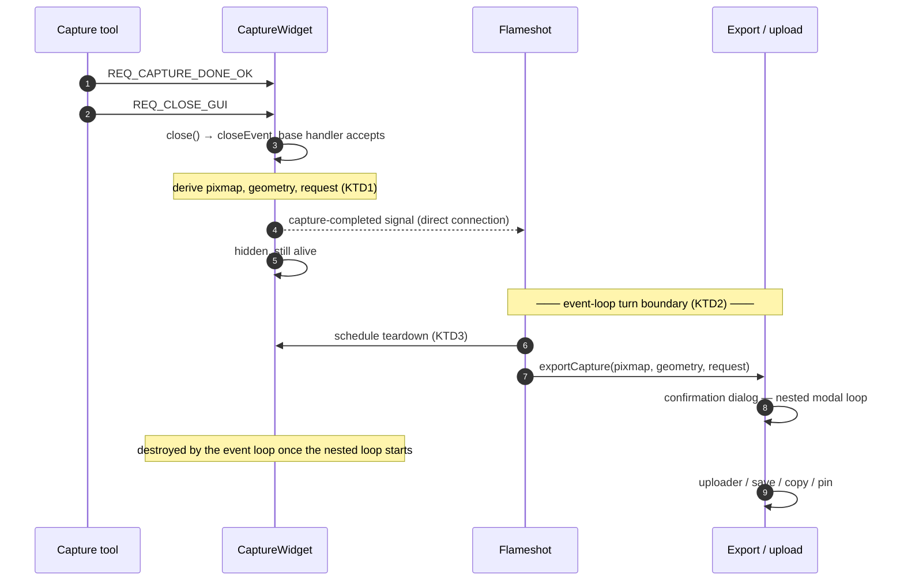
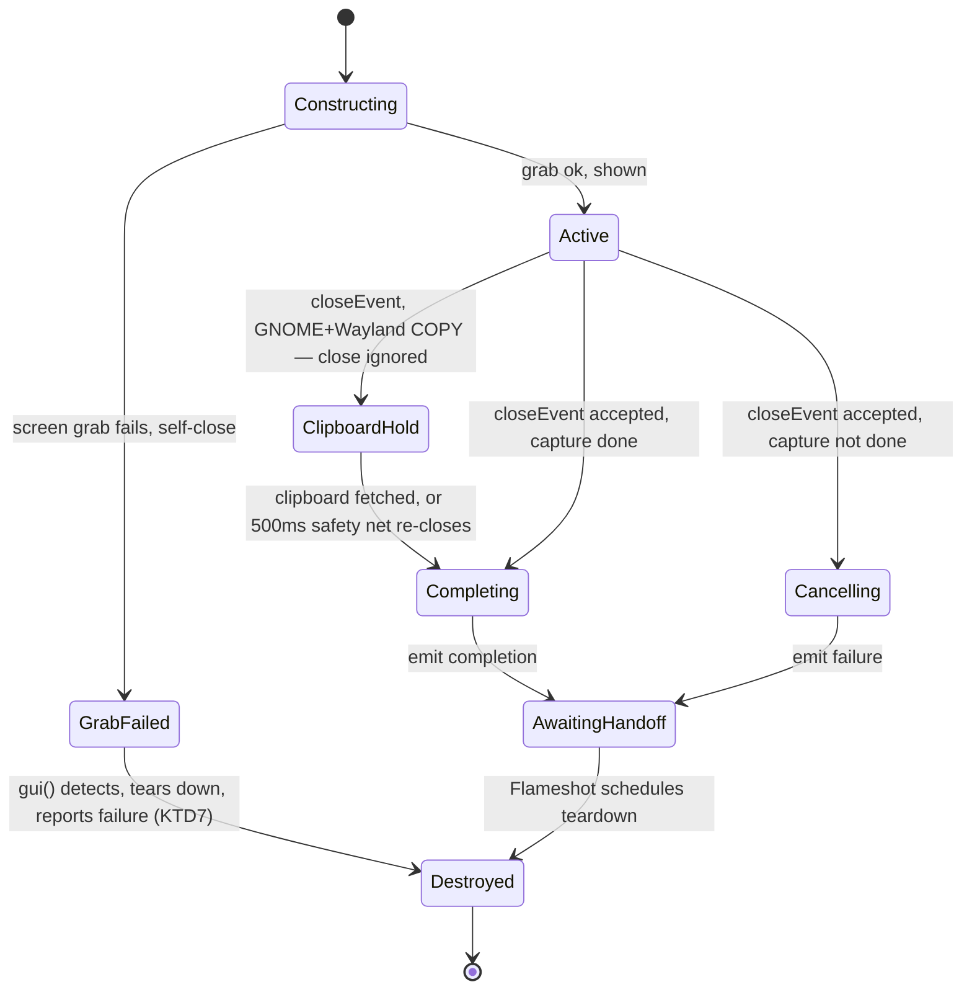

# Capture-Completion Lifecycle - Plan

## Goal Capsule

- **Objective:** Move the GUI export/upload flow off `CaptureWidget`'s destructor
  stack so it no longer runs a modal event loop and object teardown from inside
  `~CaptureWidget` while that destructor is being executed by `sendPostedEvents`.
- **Product authority:** `Flameshot` owns the post-capture lifecycle (widget
  teardown + export dispatch). Not in active scope: the CLI export paths
  (`screen()`/`full()`), the upload backends, and making the confirmation dialog
  non-modal.
- **Authority hierarchy:** Requirements (R1–R13) win on product behavior. Key
  Technical Decisions (KTD1–KTD7) win on mechanism within those requirements.
  Implementation units override neither; flows and acceptance examples illustrate
  and sequence, never amend.
- **Stop conditions:** Stop and surface a blocker if the crash cannot be
  reproduced on a Drive-enabled build before U2 lands, or if severing the
  destructor's export changes observable behavior for any task in R8.
- **Execution profile:** Runtime-verified refactor. This repo has no C++ test
  framework; proof is the build matrix plus a scripted manual walkthrough, so
  each unit's verification is an observable app outcome rather than a test run.
- **Tail ownership:** Whoever executes this plan owns the manual acceptance
  walkthrough (AE1–AE5) before the work is declared done.

---

## Product Contract

### Summary

`CaptureWidget` stops invoking `exportCapture` from its destructor. It emits a
completion (or failure) signal carrying the finished capture; `Flameshot` — which
already creates and owns the capture window — receives that signal, runs the
export/upload flow on a clean event-loop turn, then tears the widget down. This
removes the re-entrancy that segfaults on Google Drive upload confirmation, with
no change to observable behavior. The handoff funnels through the widget's close
path, and teardown is scheduled before export runs so it holds on every exit.

### Problem Frame

Confirming a Google Drive upload crashes the app. The confirmed root cause is a
re-entrancy hazard, not a logic error in the upload code.

Selecting the upload tool sets the capture as done and closes the capture window.
`CaptureWidget` has `WA_DeleteOnClose`, so Qt posts a deferred-delete event; the
event loop's `sendPostedEvents` later runs `~CaptureWidget`. The destructor then
calls `Flameshot::exportCapture`, which — for the upload task — opens a **modal**
confirmation dialog (`ImgUploadDialog::exec()`, a nested event loop) and creates
a self-deleting uploader widget with `deleteLater`.

Running a nested modal loop and posting deferred-delete events from *inside a
destructor that is itself being run by `sendPostedEvents`* corrupts the posted-event
bookkeeping. The captured backtrace crashes in
`QCoreApplication::postEvent → lockThreadPostEventList` with an atomic decrement on
a poisoned pointer (`0xffff000000000000`), reached from
`~CaptureWidget → exportCapture` under `sendPostedEvents`. The immediate trigger is
a use-after-free of the confirmation dialog (the core dump shows the dialog's
visibility read back empty even with Google Drive active), but the underlying fault
is that export runs on the destructor's stack at all.

### Key Decisions

- **`Flameshot` owns the post-capture lifecycle.** It connects to the widget's
  completion/failure signals at window-creation time and drives export + teardown.
  (session-settled: user-directed — chosen over a dedicated controller class:
  simpler, and `Flameshot` is already the de-facto owner of the window and
  `exportCapture`.) Governs R4, R5, R6, R7.
- **Export runs on a clean event-loop turn.** The completion signal hands off so
  `exportCapture` executes after `~CaptureWidget` returns and `sendPostedEvents`
  unwinds, never nested inside widget teardown. (session-settled: user-approved —
  preserves the "close then export" ordering while severing the re-entrancy.)
  Governs R5, R9.
- **Teardown ownership moves to `Flameshot`.** `WA_DeleteOnClose` comes off
  `CaptureWidget`; the widget is destroyed explicitly after completion handling.
  Governs R1, R6.
- **`exportCapture` stays the shared task executor.** The CLI paths keep calling it
  directly; only the GUI invocation site changes. Governs R12.
- **The confirmation dialog gets a deterministic lifetime.** `ImgUploadDialog`'s
  own `WA_DeleteOnClose` is removed and its lifetime scoped, so the post-`exec()`
  reads are never a use-after-free. Governs R13.

### Requirements

**Capture-completion signaling**

- R1. `CaptureWidget` must not call `exportCapture` or any export logic from its
  destructor; the destructor carries no capture-completion side effects.
- R2. On a completed capture, `CaptureWidget` emits a completion signal carrying
  the finished pixmap, the computed target geometry, and the `CaptureRequest` by
  value. On a non-completed capture it emits failure.
- R3. The final pixmap and geometry currently derived in the destructor (region
  scaling by device pixel ratio, `widgetOffset`) are derived at the completion
  point and carried in the signal, not recomputed after teardown.

**`Flameshot` ownership**

- R4. `Flameshot` connects to the widget's completion/failure signals when it
  creates the capture window in `gui()`.
- R5. On completion, `Flameshot` runs `exportCapture` on a clean event-loop turn —
  outside the widget's close/teardown call stack.
- R6. `Flameshot` owns widget teardown: the capture window is destroyed after
  completion handling via `deleteLater`, not via `WA_DeleteOnClose` or an
  export-in-destructor.
- R7. On failure or cancellation, `Flameshot` tears the widget down and emits the
  existing `captureFailed()` signal.

**Behavior preservation**

- R8. The modal confirmation dialog, the upload-without-confirmation path, and the
  SAVE / COPY / PIN / PRINT tasks behave exactly as today from the user's
  perspective. Covered by AE1–AE3.
- R9. The capture overlay closes before the export/upload UI appears (current
  ordering preserved). Covers KD "clean turn".
- R10. The GNOME/Wayland clipboard workaround — the window stays alive until
  clipboard data is read — is preserved. Covered by AE4.
- R11. `gui()`'s return of the capture widget (trayicon uses it as the
  update-notification parent) and the single-active-capture-window guard are
  unchanged.
- R12. The CLI paths (`screen()`, `full()`) and the upload backends are unchanged;
  `exportCapture` remains shared.

**Confirmation-dialog lifetime**

- R13. `ImgUploadDialog` is never accessed (`selectedVisibility()`, `recipients()`,
  `deleteLater()`) after it may have auto-destroyed. Its `WA_DeleteOnClose` is
  removed and its lifetime scoped so the post-`exec()` reads are safe. Covered by
  AE5.

### Key Flows

- F1. **GUI capture → export (happy path).** **Trigger:** user accepts a tool that
  requests an export task (e.g. upload). Sequence: capture marked done → close
  requested → overlay closes → widget emits completion with the finished capture →
  `Flameshot` handles it on a clean turn → `exportCapture` runs (confirmation
  dialog if enabled, then the uploader/save/copy/pin work) → `Flameshot` tears the
  widget down. **Covers R1, R2, R5, R6, R9.**
- F2. **Failure / cancellation.** **Trigger:** capture ends without completion, or
  the user rejects the confirmation dialog. `Flameshot` tears the widget down and
  emits `captureFailed()`; no export proceeds. **Covers R7.**

### Acceptance Examples

- AE1. **Covers R5, R8, R9.** Confirming a Google Drive upload does not crash; the
  capture overlay is gone before the confirmation dialog appears; the upload
  proceeds. (This is the reported regression.)
- AE2. **Covers R8.** With "upload without confirmation" enabled, no dialog appears
  and the upload proceeds directly.
- AE3. **Covers R8, R13.** Rejecting the confirmation dialog performs no upload,
  does not crash, and the capture window is torn down.
- AE4. **Covers R10.** On GNOME/Wayland with a COPY task, the capture window stays
  alive until the clipboard data is fetched, then the capture completes normally.
- AE5. **Covers R13.** Confirming a Drive upload with a non-default visibility
  yields the selected visibility (not an empty value), because the dialog is alive
  when its selection is read.

### Scope Boundaries

- Making the confirmation dialog non-modal — deferred; this change makes it
  possible later but keeps the dialog modal (now on a safe stack).
- Refactoring the CLI export paths (`screen()`/`full()`) — out; they already call
  `exportCapture` directly and synchronously.
- Changes to the upload backends or Google Drive logic — out.
- Broader `CaptureWidget` decomposition — out.

#### Deferred to Follow-Up Work

- Introducing a C++ test framework (Qt Test + CTest registration) so this class of
  lifecycle bug gains an automated regression guard. Considered and held out of
  this plan: it is build-system work that would delay the crash fix, and the crash
  path itself needs a live desktop session.
- Replacing the GNOME/Wayland clipboard workaround's 500 ms safety-net timer with
  a deterministic completion signal. Untouched here; the workaround is preserved
  as-is under R10.
- Removing `exportCapture`'s remaining GUI-only concerns (the macOS
  `topLevelWidgets` poke in `saveToFilesystemGUI`) so the CLI and GUI paths stop
  sharing widget-aware code.

### Sources / Research

- `src/widgets/capture/capturewidget.cpp:317-331` — destructor calls
  `exportCapture` on completion; `:625-657` — `closeEvent` GNOME/Wayland clipboard
  workaround; `:1439-1456` — `REQ_CLOSE_GUI` / `REQ_CAPTURE_DONE_OK` handling;
  `:101` — `WA_DeleteOnClose`; `:126-129` — constructor closes itself on a failed
  screen grab; `:1357-1364` — `ACCEPT_ON_SELECT` marks done and closes.
- `src/core/flameshot.cpp:123-182` — `gui()` creates/owns `m_captureWindow`
  (`QPointer`), single-window guard, cross-platform show, returns the widget;
  `:134-139` — macOS closes *and immediately deletes* a pre-existing capture
  window; `:450-536` — `exportCapture` (SAVE/COPY/PIN/PRINT/UPLOAD); `:502-508` —
  the post-`exec()` dialog access that crashed; `:232`,`:248` — CLI call sites.
- `src/widgets/imguploaddialog.cpp:24` — dialog `WA_DeleteOnClose`;
  `:137-152` — the `selectedVisibility()` / `recipients()` reads that happen after
  `exec()` returns.
- `src/core/capturerequest.h:66` — `CaptureRequest`'s default constructor is
  **private**, so the type is not default-constructible for `QMetaType` and cannot
  cross a `Qt::QueuedConnection` by value without a public API change. Shapes KTD2.
- `src/utils/screenshotsaver.cpp:253-270` — GNOME workaround keeps the widget alive
  via a `QPointer` guard and a 500 ms safety net; `:284-292` — macOS
  `saveToFilesystemGUI` locates the live `CaptureWidget` through
  `qApp->topLevelWidgets()`. Shapes the deferred-teardown constraint in Risks.
- `src/main.cpp:70-91` — `captureFailed()` drives `qApp->exit(E_ABORTED)` and
  `captureTaken()` drives `exit(E_OK)` for CLI-originated captures.
- `src/widgets/trayicon.cpp:284-286` — consumes `gui()`'s returned widget as the
  update-notification parent.
- Qt 6 documentation (`QObject::deleteLater`): entering and leaving a nested event
  loop does not itself trigger deferred deletion, but an object already scheduled
  for deletion is deleted as soon as a nested event loop starts. This is why a
  `WA_DeleteOnClose` dialog cannot be read after `exec()` returns, and why
  scheduled widget teardown lands mid-export rather than after it.
- Crash evidence: backtrace bottoms out in `sendPostedEvents → QObject::event →
  ~CaptureWidget (capturewidget.cpp:327) → exportCapture (flameshot.cpp:508) →
  postEvent → lockThreadPostEventList`; poisoned-pointer atomic decrement.

### Outstanding Questions

None blocking. The three questions the brainstorm deferred to planning are
resolved: emission point and clean-turn mechanism by KTD1 and KTD2, widget
tracking and the relocated failure emission by KTD4 and KTD5, and the
`exportCapture` guard question by KTD2 (no guard is needed — the completion
handler calls it exactly as the CLI paths already do).

---

## Planning Contract

**Product Contract preservation:** unchanged. R1–R13, F1–F2, AE1–AE5, and all five
Key Decisions carry forward with their meaning and IDs intact. One planning-time
behavior delta is recorded as KTD5 rather than as a requirement change; it narrows
no existing requirement, because R7 continues to govern every close and cancel
path. Scope Boundaries gained a `Deferred to Follow-Up Work` subsection for
plan-local sequencing decisions.

### Key Technical Decisions

- KTD1. **Emit completion from `closeEvent`, after the base-class handler accepts
  the close.** Chosen over the brainstorm's other candidate, a dedicated finish
  method: closes arrive from five initiators — the tool signal, accept-on-select,
  the exit tool and Esc, the GNOME workaround's re-close, and the constructor's
  self-close on a failed grab — so a finish method would have to be called from
  each, and the GNOME re-close would be the easy one to miss. `closeEvent` already
  funnels all five, and runs while the selection, screenshot, and request are still
  valid. The workaround's `event->ignore()` early-return suppresses emission on the
  first pass for free, and because the workaround strips the COPY task before
  returning, the request read at emission time is the corrected one. **Constraint:**
  branch on capture-done state *before* deriving the payload — on the constructor's
  self-close the selection widget does not exist yet, so a payload derived ahead of
  the branch would dereference null. Governs R1, R2, R3, R9, R10.
- KTD2. **Keep the completion signal a direct connection and defer export with a
  zero-delay single-shot inside `Flameshot`'s handler.** A `Qt::QueuedConnection`
  would need `CaptureRequest` to be queue-able by value, but its default
  constructor is private, so queued delivery would fail at runtime unless the type
  gains a public default constructor and metatype registration — a public API
  change to a shared type for no behavioral gain. Deferring inside the handler
  reaches the same clean turn and touches nothing outside this refactor.
  (session-settled: user-approved — chosen over nesting export inside widget
  teardown: preserves the "close then export" ordering while severing the
  re-entrancy.) Governs R5, R9.
- KTD3. **Schedule widget teardown before running export, in the same handler.**
  Teardown then holds on every exit — a rejected confirmation dialog, an export
  early-return, an unavailable uploader — without each path repeating it. Safe
  because the completion payload is copied out of the widget at emission, so export
  never reads widget state. (session-settled: user-directed — chosen over tearing
  down after export completes: teardown stays independent of export's outcome, so
  no early-return path can leave the overlay alive.) Governs R6, R7.
- KTD4. **Track the widget through the existing `m_captureWindow` pointer and guard
  the deferred handler against an already-destroyed widget.** No new tracking
  member is needed, and coverage is complete: `flameshot.cpp:161` is the only
  `CaptureWidget` construction site in the tree, so connecting there means no
  capture widget can exist without an owner to tear it down once
  `WA_DeleteOnClose` is gone. The guard is load-bearing rather than defensive: on
  macOS `gui()` closes a pre-existing capture window and deletes it immediately, so
  a handler deferred by KTD2 can fire after that widget is gone. Governs R4, R6,
  R11.
- KTD5. **A capture widget destroyed without ever being closed no longer reports
  "capture aborted".** Today's destructor emits failure unconditionally, which also
  fires at application shutdown and on the macOS window-replacement path. Every
  real close and cancel path still reports failure under R7, and CLI exit codes are
  unaffected because CLI-originated captures always end through a close.
  (session-settled: user-directed — chosen over a guarded destructor fallback:
  keeps the destructor side-effect-free, which is the point of the refactor.)
  Governs R1, R7.
- KTD6. **Scope the confirmation dialog to the enclosing block and drop its
  self-destruct attribute.** With `WA_DeleteOnClose` set, the dialog's lifetime is
  not guaranteed past `exec()`, so reading the visibility selection and recipients
  afterwards is a use-after-free. A block-scoped dialog with the attribute removed
  makes those reads deterministic and removes the manual `deleteLater` entirely.
  Governs R13.
- KTD7. **`gui()` checks the constructed widget for a failed screen grab before
  showing it.** The constructor closes itself when the grab fails; today
  `WA_DeleteOnClose` turns that into a deferred self-destruct that reports failure
  from the destructor. Once the attribute is gone, and with no receiver connected
  during construction, that path would otherwise leave an empty overlay on screen.
  `gui()` reads a grab-failure flag off the widget, tears it down, and reports
  failure directly. Governs R7, R11.

### High-Level Technical Design

Directional guidance for reviewing the shape of the handoff — not an
implementation specification.

The post-completion sequence, with the turn boundary that severs the re-entrancy:

Widget lifetime and the emission gate. The clipboard-hold state is the one place a
close does **not** produce an emission, which is what preserves R10:

### Sequencing and Landing

U1 is additive and ships without behavior change. U2 is the switch-over: it is the
only unit where the app's export path changes hands. U3 is independent of the
handoff and may land first if that is convenient — it fixes its own
use-after-free. **U2 and U4 must land together or in immediate succession**;
between them, a failed screen grab leaves an empty overlay on screen rather than
aborting. U5 lands last, once there is a stable flow to script.

### Risks & Dependencies

- **Teardown must stay deferred, not immediate.** On macOS, `saveToFilesystemGUI`
  finds the live capture widget through `qApp->topLevelWidgets()` before opening
  the save dialog. Scheduled teardown leaves the widget listed during the handler,
  preserving that lookup; switching KTD3 to a synchronous delete would silently
  break the macOS SAVE path.
- **The deferred handler can outlive its widget.** The macOS pre-existing-window
  path deletes the widget immediately after closing it (KTD4). Without the guard
  this is a use-after-free in the fix itself.
- **Emission can run on a partially-constructed widget.** The constructor closes
  itself when the screen grab fails, which reaches `closeEvent` before
  `initSelection()` has run. Mitigated by KTD1's ordering constraint: branch on
  capture-done state first, so the null selection widget is never read on the
  failure branch.
- **The crash is platform- and account-dependent.** Reproducing AE1 needs a
  Drive-enabled build and a real Google account; AE4 needs a GNOME/Wayland
  session; the macOS paths in KTD4 and the Risks above need a macOS build. Any
  platform not exercised is an untested claim, not a verified one — say so
  explicitly rather than reporting done.
- **No automated regression guard.** Accepted (see Deferred to Follow-Up Work). A
  future re-entrancy regression here would only be caught by the manual
  walkthrough.

### System-Wide Impact

`captureFailed()` and `captureTaken()` drive CLI exit codes in
`requestCaptureAndWait` — `E_ABORTED` and `E_OK` respectively. Relocating the
failure emission from the destructor to `Flameshot` (R7, KTD5) keeps every
CLI-reachable path intact, because a CLI-originated `flameshot gui` always ends
through a close. Cancelling a CLI capture must still exit `E_ABORTED`; this is a
verification gate, not an assumption.

---

## Implementation Units

### U1. Capture-completion signals emitted from the close path

**Goal:** `CaptureWidget` announces completion and failure with the finished
capture payload. Additive — the destructor is untouched and nothing consumes the
signals yet, so behavior is unchanged.

**Requirements:** R2, R3. Mechanism per KTD1.

**Dependencies:** none.

**Files:**
- `src/widgets/capture/capturewidget.h` — declare the completion and failure
  signals and the grab-failure accessor U4 will read.
- `src/widgets/capture/capturewidget.cpp` — emit from `closeEvent`; record the
  constructor's grab failure.

**Approach:**
1. Add a completion signal carrying the pixmap, target geometry, and
   `CaptureRequest` by value, plus a parameterless failure signal.
2. In `closeEvent`, after the base-class handler runs and the event is accepted,
   branch on capture-done state first (per KTD1's constraint). On the done branch,
   derive the payload exactly as the destructor does today — device-pixel-ratio
   scaling of the selection region, `widgetOffset` applied to the geometry, and the
   `setLastRegion` cache write — and emit completion. On the not-done branch emit
   failure without touching the selection widget, which may not exist yet.
3. Leave the GNOME workaround branch's early return ahead of all of this, so the
   first ignored close emits nothing.
4. Record grab failure from the constructor's failure branch in a flag the owner
   can read, and add a const accessor for it.
5. Do not touch the destructor in this unit.

**Patterns to follow:** the existing `colorChanged` / `toolSizeChanged` signal
declarations in `src/widgets/capture/capturewidget.h`; the payload derivation
currently in `~CaptureWidget` (`capturewidget.cpp:317-328`), moved verbatim in
meaning.

**Execution note:** Reproduce the Drive-confirmation crash on a Drive-enabled
build before writing any code, so the fix is proven against the real backtrace
rather than assumed.

**Test scenarios:**
- Build succeeds in all four `ENABLE_IMGUR` / `ENABLE_GDRIVE` combinations.
- Accept a GUI capture with SAVE: file is written and the notification appears,
  exactly as before this unit (the destructor is still the export driver).
- Cancel a GUI capture with Esc: "Screenshot aborted" still appears; CLI-invoked
  `flameshot gui` still exits non-zero.
- GNOME/Wayland COPY capture: clipboard still receives the image and the window
  still closes — confirming the ignored first close emits nothing.
- Forced screen-grab failure: the constructor's self-close emits failure without
  crashing, proving the not-done branch never reads the uninitialized selection
  widget (the abort itself is not yet handled — that is U4).

**Verification:** The four-combination build matrix compiles, and the SAVE, cancel,
and GNOME COPY flows behave identically to the pre-change build.

---

### U2. Export and teardown ownership moves to `Flameshot`

**Goal:** `Flameshot` drives export on a clean event-loop turn and owns widget
teardown. `~CaptureWidget` becomes free of capture-completion side effects. This
is the unit that fixes the crash.

**Requirements:** R1, R4, R5, R6, R7, R9. Realizes F1 and F2 end to end. Mechanism
per KTD2, KTD3, KTD4, KTD5.

**Dependencies:** U1.

**Files:**
- `src/core/flameshot.h` — declare the completion and failure handlers.
- `src/core/flameshot.cpp` — connect at window creation in `gui()`; implement the
  deferred handler.
- `src/widgets/capture/capturewidget.cpp` — remove the destructor's export and
  failure emission; remove `WA_DeleteOnClose`.

**Approach:**
1. In `gui()`, immediately after constructing the capture window and before
   showing it, connect the widget's completion and failure signals to `Flameshot`
   handlers. Leave the single-window guard, the cross-platform show block, and the
   returned widget pointer untouched (R11).
2. The completion handler captures the payload by value and defers the rest to a
   zero-delay single-shot (KTD2). The deferred body holds a guarded pointer to the
   widget, schedules its teardown (KTD3), then calls `exportCapture` with a
   non-const geometry lvalue — the same call the CLI paths make.
3. The failure handler schedules teardown and emits the existing `captureFailed()`.
4. Strip the destructor down to the macOS `topLevelWidgets` block: remove the
   payload derivation, the `exportCapture` call, and the `captureFailed()`
   emission. Remove `WA_DeleteOnClose` from the constructor and leave
   `WA_QuitOnClose` as it is.

**Patterns to follow:** the guarded deferral in
`src/utils/screenshotsaver.cpp:241-245` (a `QPointer` snapshot captured into a
zero-delay single-shot) is the exact idiom KTD2 and KTD4 need; the deferred
`gui(request)` dispatch at `src/core/flameshot.cpp:440-441` shows the established
single-shot-into-lambda style.

**Execution note:** Confirm the crash is gone against the same reproduction used
in U1 before moving on — this unit's whole purpose is that one backtrace.

**Test scenarios:**
- AE1: confirming a Google Drive upload does not crash, the overlay is gone before
  the confirmation dialog appears, and the upload completes.
- AE2: with "upload without confirmation" enabled, no dialog appears and the
  upload proceeds.
- AE3: rejecting the confirmation dialog performs no upload, does not crash, and
  the overlay is gone — proving teardown-before-export (KTD3).
- SAVE, COPY, PIN, and PRINT tasks each behave as before, including the save
  dialog appearing only after the overlay is gone (R8, R9).
- Cancel with Esc and with the exit tool: "Screenshot aborted" appears; a
  CLI-invoked `flameshot gui` exits `E_ABORTED`.
- `--accept-on-select` capture completes and exports without the overlay
  lingering.
- Trayicon capture still receives a usable widget for the update notification
  (R11); a second capture request while one is open is still refused.
- Imgur-enabled build: upload, copy-URL, and history are unchanged.

**Verification:** AE1–AE3 pass on a Drive-enabled build; the crash no longer
reproduces; every task in R8 behaves as before; CLI exit codes are unchanged.

---

### U3. Deterministic confirmation-dialog lifetime

**Goal:** The confirmation dialog's visibility and recipient selections are read
from a guaranteed-live object. Independent of the handoff — this fixes its own
use-after-free.

**Requirements:** R13. Mechanism per KTD6.

**Dependencies:** none. May land before U1 if convenient.

**Files:**
- `src/widgets/imguploaddialog.cpp` — remove `WA_DeleteOnClose`.
- `src/core/flameshot.cpp` — scope the dialog to the upload block and drop the
  manual `deleteLater`.

**Approach:**
1. Remove the `WA_DeleteOnClose` attribute from the dialog's constructor.
2. In `exportCapture`'s upload branch, give the dialog block scope rather than
   heap-allocating it, so it outlives every read of `selectedVisibility()` and
   `recipients()` and is destroyed deterministically on block exit.
3. Delete the now-redundant `deleteLater` call and the comment describing the
   read-back race it was working around.
4. Leave the reject early-return, the parentless construction, and the modality
   as they are.

**Test scenarios:**
- AE5: confirm a Drive upload with each non-default visibility ("Private", "Anyone
  on the internet", "Specific people") and verify the upload uses the selected
  value rather than an empty one.
- Select "Specific people by email", enter valid recipients, confirm: the
  recipient list reaches the upload.
- Select "Specific people by email" with no valid address: the dialog stays open
  with the validation message and does not leak or crash.
- Select "Anyone on the internet" and decline the public-share warning: the dialog
  stays open, no upload happens.
- AE3: reject the dialog outright — no upload, no crash.
- Imgur-enabled build with Drive disabled: the dialog shows no visibility selector
  and confirming still uploads.

**Verification:** Every visibility option round-trips to the upload with the
selected value; rejecting and validation-failing paths neither upload nor crash.

---

### U4. Handle construction-time screen-grab failure in `gui()`

**Goal:** A failed screen grab aborts the capture instead of leaving an empty
overlay on screen — closing the gap that removing `WA_DeleteOnClose` opens.

**Requirements:** R7, R11. Extends F2 to the construction-failure case. Mechanism
per KTD7.

**Dependencies:** U1 (the grab-failure accessor), U2 (which removes the attribute
this path relied on). Must land with U2 or immediately after — see Sequencing.

**Files:**
- `src/core/flameshot.cpp` — check the constructed widget in `gui()` before
  showing it.

**Approach:**
1. After constructing the capture window and connecting its signals, read the
   grab-failure flag added in U1.
2. On failure, tear the widget down, clear the tracking pointer, emit
   `captureFailed()`, and return null — without showing the window.
3. Leave the success path, the single-window guard, and the returned pointer
   unchanged.

**Test scenarios:**
- Force the screen grab to fail (temporarily stub the grabber's failure branch, or
  run where no screen is available): no overlay appears, "Screenshot aborted" is
  reported, and a CLI-invoked capture exits `E_ABORTED`.
- Confirm the same failure case does not leave a stale capture window that blocks
  the next capture request (R11).
- Normal capture is unaffected: the overlay appears and `gui()` still returns the
  widget the trayicon uses.

**Verification:** A failed grab produces an abort with no visible overlay and no
stuck single-window guard; normal captures are unchanged.

---

### U5. Extend the manual acceptance walkthrough

**Goal:** The capture-completion lifecycle has a repeatable, human-run script, so
this refactor and future changes to it are verified the same way each time.

**Requirements:** covers AE1–AE5 and the R8 task matrix as executable procedure.

**Dependencies:** U1, U2, U3, U4.

**Files:**
- `tests/capture_lifecycle.sh` — new interactive walkthrough script.
- `docs/codebase/TESTING.md` — list the new script alongside the existing two.

**Approach:**
1. Add a script following the existing `tests/action_options.sh` conventions:
   POSIX `sh`, the flameshot binary path as `$1`, a printed expectation before
   each case, and a `wait_for_key` pause for human confirmation.
2. Cover the cases the refactor puts at risk: Drive confirm, Drive
   upload-without-confirmation, dialog reject, each non-default visibility, the
   SAVE / COPY / PIN / PRINT tasks, Esc and exit-tool cancellation,
   `--accept-on-select`, and the GNOME/Wayland COPY case.
3. Mark the platform-gated cases (GNOME/Wayland, macOS) so an operator running
   elsewhere records them as not-exercised rather than passed.
4. Update the testing doc's script inventory and run commands.

**Execution note:** This is procedure, not product code — the proof is that an
operator who has never seen this plan can follow the script and reach a verdict.

**Test scenarios:** `Test expectation: none — this unit is the test procedure.`
Verify by having the script run end-to-end once against a Drive-enabled build,
with each case reached and each expectation printed before its action.

**Verification:** The script runs start to finish without operator confusion, and
its cases cover AE1–AE5 plus every task named in R8.

---

## Verification Contract

No C++ test framework exists in this repo — the only automated tests are the
interactive shell scripts under `tests/`, and this plan introduces no framework
(see Deferred to Follow-Up Work). Verification is the build matrix plus scripted
manual acceptance.

| Gate | Command / procedure | Applies to |
|---|---|---|
| Build matrix | `cmake -B build -DENABLE_IMGUR=<ON/OFF> -DENABLE_GDRIVE=<ON/OFF> && cmake --build build` for all four combinations | U1, U2, U3, U4 |
| Crash reproduction | Confirm a Drive upload on a Drive-enabled build: crashes before U2, does not crash after | U2 |
| Acceptance walkthrough | AE1–AE5 against a real Google account on a Drive-enabled build | U2, U3 |
| Task matrix | SAVE, COPY, PIN, PRINT, `--accept-on-select`, and cancellation each behave as before, with the overlay gone before any export UI | U2 |
| CLI regression | `tests/action_options.sh` and `tests/path_option.sh` against the built binary; `flameshot gui` cancellation still exits `E_ABORTED` | U2, U4 |
| GNOME/Wayland clipboard | GNOME Wayland session, COPY task: window survives until the clipboard is read, then completes (AE4) | U1, U2 |
| Imgur regression | Imgur-enabled build: upload, copy-URL, history, delete unchanged | U2, U3 |
| macOS lifecycle | macOS build: SAVE via the save dialog works, and requesting a capture while one is open replaces the window without crashing | U2 |
| Grab-failure path | Forced grab failure: no overlay, abort reported, next capture still possible | U4 |
| Walkthrough dry run | `sh tests/capture_lifecycle.sh ./build/src/flameshot` end to end | U5 |

Platform-gated gates (GNOME/Wayland, macOS) that cannot be run must be reported
as not exercised, never as passed.

---

## Definition of Done

- All units landed in dependency order, with U2 and U4 together or in immediate
  succession; the four-combination build matrix compiles and the app runs in each.
- The Drive-confirmation crash no longer reproduces, verified against the same
  reproduction that produced the original backtrace.
- `~CaptureWidget` contains no capture-completion side effects: no payload
  derivation, no `exportCapture` call, no signal emission. `WA_DeleteOnClose` is
  gone from both `CaptureWidget` and `ImgUploadDialog`.
- AE1–AE5 pass, and every task named in R8 behaves as it did before the refactor,
  including the overlay closing before any export or upload UI appears.
- Cancellation still reports abort on every close path, and CLI exit codes are
  unchanged.
- The GNOME/Wayland clipboard workaround still holds the window open until the
  clipboard is read, or is explicitly reported as not exercised.
- `gui()` still returns the capture widget for the trayicon's update notification,
  and the single-active-window guard still refuses a second concurrent capture.
- The CLI export paths, the upload backends, and dialog modality are untouched.
- `tests/capture_lifecycle.sh` exists, has been run once end to end, and is listed
  in the testing doc.
- No dead, stubbed, or experimental code from abandoned approaches remains in the
  diff — including any temporary grab-failure stub used to test U4.
