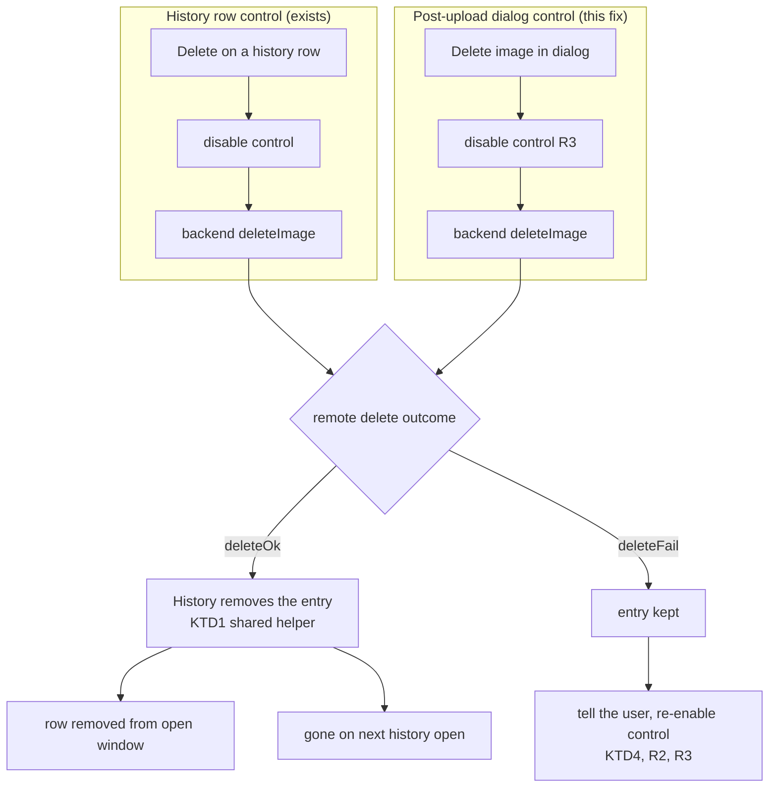

# Post-Upload Delete Leaves History Entry - Plan

## Goal Capsule

- **Objective:** Make "Delete image" in the post-upload dialog remove the local
  history entry after the backend confirms the remote delete, so the screenshot
  stops appearing in the history window — and route both delete controls through
  one shared removal path so the omission cannot recur.
- **Product authority:** `ImgUploaderBase` owns the post-upload dialog's delete
  outcome handling; `History` owns the cache directory and entry removal. Not in
  active scope: how either backend confirms a delete, and when the history
  window reloads.
- **Authority hierarchy:** Requirements (R1–R4) win on product behavior, and the
  carried Key Decisions (KD1–KD2) win on deletion semantics within them. Key
  Technical Decisions (KTD1–KTD4) win on mechanism within both. Implementation
  units override none of these.
- **Stop conditions:** Stop and surface a blocker if removing the entry on
  `deleteOk` turns out to break the history-row control that already relies on
  that signal, or if the shared helper cannot serve both call sites without
  changing the history-row path's observable behavior.

---

## Product Contract

### Summary

Complete the delete contract the Google Drive work already committed to:
deleting from the post-upload dialog must remove the remote file *and* the local
history entry, as deleting from a history row already does. Adds the dialog's
missing failure feedback and an in-flight guard, and unifies both controls onto
a single removal helper.

### Problem Frame

Clicking **Delete image** in the post-upload "Upload image" dialog deletes the
remote file but leaves the local history thumbnail on disk. The history window
rebuilds itself purely from a directory listing of the cache, so the deleted
screenshot still renders as a row — now with a link that no longer resolves.

The causal chain is fully traced and has no gaps:

1. A successful upload writes a thumbnail into the history cache directory,
   keyed by the packed history filename the uploader retains
   (`src/tools/imgupload/storages/gdrive/gdriveuploader.cpp:477-479` for Drive,
   `src/tools/imgupload/storages/imgur/imguruploader.cpp:52-55` for Imgur).
2. **Delete image** invokes `ImgUploaderBase::deleteCurrentImage()`
   (`src/tools/imgupload/storages/imguploaderbase.cpp:180-185`), which unpacks
   the stored name and calls the backend's `deleteImage()` — and nothing else.
3. The Drive backend performs the remote delete and emits `deleteOk()`
   (`src/tools/imgupload/storages/gdrive/gdriveuploader.cpp:554`).
4. Nothing in `ImgUploaderBase` is connected to `deleteOk`. The only cache-entry
   removal in the codebase is the free function `removeCacheFile()`
   (`src/widgets/uploadlineitem.cpp:16-22`), wired exclusively into the
   history-row delete path (`src/widgets/uploadlineitem.cpp:69-77`) — one call
   site, verified by search.
5. `UploadHistory::loadHistory()` (`src/widgets/uploadhistory.cpp:40-54`) lists
   the cache directory via `History::history()`
   (`src/utils/history.cpp:56-75`). The orphaned thumbnail is still there, so
   the row appears.

**This is an unmet requirement, not only an inherited defect.** The Google Drive
plan's R13 (`docs/plans/2026-07-24-001-feat-google-drive-upload-plan.md`)
required that *both* delete controls — post-upload dialog and history rows —
remove the remote file "then remove the history entry". Its history unit
implemented the outcome-gated removal only inside the history-row widget, and
its acceptance-example coverage for the post-upload dialog checked only that the
file was removed *in Drive*, never that the history entry disappeared. So the
requirement's post-upload-dialog half never landed and no test scenario would
have caught it. The upstream code had the same gap before Drive existed
(`deleteCurrentImage` is untouched since commit `bd3431a9`), and Imgur is
affected identically — Drive merely makes it visible, because the stale row's
link now resolves to nothing.

A second, related gap sits in the same code path: the dialog surfaces no
feedback at all when a delete *fails*. The Drive backend reports its HTTP
failures through its own notification widget, but its authorization-canceled and
authorization-failed paths emit `deleteFail` silently
(`src/tools/imgupload/storages/gdrive/gdriveuploader.cpp:565-569`). A user who
cancels consent during a delete sees nothing happen and the entry stays — the
same observable symptom as the reported bug, from a different cause.

### Requirements

- R1. Deleting from the post-upload dialog removes the remote file and then the
  local history entry, so the screenshot no longer appears when the history
  window is next opened. (Completes origin R13 for the post-upload-dialog
  control; origin AE8.)
- R2. A failed or canceled delete from the post-upload dialog keeps the history
  entry and tells the user why, matching the history-row control's behavior.
- R3. The delete control cannot start a second delete while one is in flight,
  and becomes usable again if the delete fails.
- R4. Both delete controls remove the history entry through one shared code
  path, so a future delete control cannot silently omit the removal.

### Key Decisions

- KD1. **Removal stays gated on backend confirmation.** The local entry is
  dropped only after the backend reports success, never optimistically.
  (Carried from the origin plan's history unit — chosen over synchronous
  removal, so a failed remote delete keeps a recoverable entry.) Governs R1, R2.
- KD2. **Imgur's browser hand-off still counts as immediate success.** Imgur's
  `deleteImage` opens a browser delete page and reports success right away
  without waiting for the user to confirm there. (Carried from the origin plan
  — chosen over adding a real confirmation signal.) Governs R1.

### Acceptance Examples

- AE1. **Covers R1.** **Given** a screenshot just uploaded to Google Drive with
  the post-upload dialog showing, **When** the user clicks "Delete image" and
  the delete succeeds, **Then** the file is gone from Drive and the screenshot
  is absent from the history window when it is next opened.
- AE2. **Covers R2.** **Given** the same dialog with the network unavailable or
  Google consent canceled, **When** the user clicks "Delete image", **Then** the
  dialog states the delete failed and the screenshot is still listed in the
  history window.
- AE3. **Covers R3.** **Given** a delete in flight from the post-upload dialog,
  **When** the user clicks "Delete image" again, **Then** no second delete is
  issued; after a failure the control is usable again.
- AE4. **Covers R4, R1.** **Given** a screenshot in the history window,
  **When** the user deletes it from its row, **Then** the row disappears and the
  entry is gone from the cache — unchanged from today's behavior.

### Scope Boundaries

- Deletion semantics for either backend are unchanged. Imgur still reports
  success on handing off to the browser (KD2); Drive still treats an
  already-gone file as deleted.
- The post-upload dialog is not prevented from closing while a delete is in
  flight. See KTD3 for the accepted race.

#### Deferred to Follow-Up Work

- **An already-open history window does not refresh.** `loadHistory()` runs only
  when the window is first constructed (`src/core/flameshot.cpp:370-373`), so an
  open window is already stale for *new uploads* too. Making it reload is a
  broader, pre-existing concern affecting every history mutation, not just
  delete. User-confirmed as out of scope; the entry is gone on next open.
- **Imgur cannot confirm a delete.** Because Imgur's delete is a browser
  hand-off (KD2), a user who abandons the Imgur delete page loses the history
  entry for a file that still exists. Distinguishing "confirmed" from "handed
  off" needs a real confirmation channel — separate work, and a reversal of a
  settled decision.
- **Copy URL / Open URL stay enabled after a successful delete**, pointing at a
  dead link. Arguably worth disabling; not the reported defect, and the user may
  still want the URL for reference.

#### Outside this fix's identity

- Adding an automated C++ test framework. The repo has none; verification is
  build matrix plus guided manual walkthroughs.

---

## Planning Contract

Solo-planned from a completed `ce-debug` investigation. The Google Drive plan
serves as origin for requirement traceability only (its R13 and AE8); that plan
is landed and is not reopened. Scope confirmed with the user before plan-write,
including explicit approval to touch already-committed branch code where it
removes duplication.

### Key Technical Decisions

- KTD1. **`History` owns cache-entry removal.** Add a removal method to
  `History` taking the packed entry name, and retire the free
  `removeCacheFile()` helper so both delete controls call the same method
  (R4). `History` already owns the cache directory path, the packing/unpacking
  of entry names, and the retention pruning — removal is the missing verb of
  that same responsibility. Rejected alternatives are recorded under
  **Alternative Approaches Considered**. Governs R1, R4.
- KTD2. **Delete-outcome connections are made once, where the button is
  created.** Wire `deleteOk` and `deleteFail` in the method that builds the
  post-upload dialog, not inside the delete slot. Connecting inside the slot
  would stack a fresh pair of connections on every retry after a failure,
  making the number of removal attempts depend on click history; a single-shot
  connection only narrows that, because a `deleteFail` leaves the unfired
  success connection alive. Connecting where the button is born gives the
  connection the same lifetime as the control it serves and keeps the slot a
  pure action. Governs R1, R2.
- KTD3. **The close-mid-delete race is accepted and documented.** If the user
  starts a Drive delete and closes the dialog before it resolves, the widget's
  `WA_DeleteOnClose` teardown destroys its network manager, aborting the reply,
  so neither outcome signal fires and the entry survives. Blocking or deferring
  the close would fight the established teardown lifecycle for a rare case, and
  removing the entry up front contradicts KD1 — the guarantee that a failed
  delete keeps its entry is worth more than closing this window. The in-flight
  control guard (R3) keeps the window narrow and makes the pending state
  visible, and the user can still delete the row from the history window
  afterward. Documented as a known limitation in the manual walkthrough so an
  operator does not record it as a failure. Governs R3.
- KTD4. **The dialog owns backend-neutral delete-failure feedback.** The failure
  message is shown from the shared dialog on `deleteFail`, so every backend and
  every failure cause is covered — including the Drive authorization-canceled
  and authorization-failed paths that are silent today. The Drive backend's own
  HTTP-failure message then becomes a duplicate for this path and is removed;
  its success message is kept, since the shared dialog does not message on
  success. Governs R2.

### High-Level Technical Design

Both delete controls converge on one confirmation-gated removal path. The fix
adds the right-hand branch and the shared helper; the left-hand branch exists
and is only re-pointed at the helper.

Directional only — the prose and the units are authoritative.

---

## Implementation Units

### U1. One shared history-entry removal path

- **Goal:** Give `History` the removal verb and route the existing history-row
  control through it, retiring the free helper. Behavior-neutral on its own.
- **Requirements:** R4 (cited KTD: KTD1).
- **Dependencies:** None.
- **Files:** `src/utils/history.h`, `src/utils/history.cpp`,
  `src/widgets/uploadlineitem.h`, `src/widgets/uploadlineitem.cpp`,
  `src/widgets/uploadhistory.cpp`.
- **Approach:**
  1. Add a removal method to `History` that takes the packed entry name (the
     same shape `packFileName` produces and the uploaders retain), resolves it
     against the cache directory, and tolerates an already-absent file.
  2. Delete the free `removeCacheFile()` function and its header declaration.
  3. The history line item currently receives a fully-qualified cache path used
     for nothing but that removal — the timestamp it displays is resolved by its
     caller. Change it to carry the bare packed entry name instead and call the
     new method. Its caller already holds both forms, so this is a
     narrowing of what gets passed, not new plumbing.
- **Patterns to follow:** the existing `History` members that resolve names
  against `path()`; the caller's current construction of the line item in
  `UploadHistory::addLine`.
- **Test scenarios:**
  - Deleting a Drive entry from a history row still removes the row and the
    cached thumbnail (unchanged behavior).
  - Deleting an Imgur entry from a history row still removes the row and the
    cached thumbnail.
  - Deleting an entry whose cached file was already removed out from under the
    app (deleted manually from the cache directory) does not crash or error.
  - A legacy entry name with no type or token segment still resolves to the
    right cached file for removal.
- **Verification:** History window opens, lists entries, and row deletes behave
  exactly as before the change; the retired helper has no remaining references.

### U2. The post-upload dialog honors the delete outcome

- **Goal:** Remove the history entry when the dialog's delete succeeds, keep it
  and say so when it fails, and prevent a second in-flight delete.
- **Requirements:** R1, R2, R3 (cited KTDs: KTD1, KTD2, KTD3, KTD4; carried
  KD1, KD2).
- **Dependencies:** U1.
- **Files:** `src/tools/imgupload/storages/imguploaderbase.cpp`,
  `src/tools/imgupload/storages/gdrive/gdriveuploader.cpp`.
- **Approach:**
  1. Where the post-upload dialog builds its buttons, connect the delete-outcome
     signals once (KTD2): on success, remove the retained packed entry via U1's
     method; on failure, show the reason through the dialog's notification
     widget and re-enable the delete control.
  2. In the delete slot, disable the control before dispatching so a second
     click cannot start a parallel delete (R3), mirroring the guard the
     history-row control already applies. Leave it disabled on success — the
     file is gone.
  3. Remove the Drive backend's now-duplicate HTTP-failure notification (KTD4);
     the shared dialog covers it, and this also gives the previously-silent
     authorization-canceled and authorization-failed paths a message. Keep the
     Drive success notification.
  4. Guard the notification access — the widget exists whenever the delete
     control does, but the slot should not assume it.
- **Patterns to follow:** the outcome-gated delete in
  `src/widgets/uploadlineitem.cpp` (the same signal contract, one layer up);
  the existing button wiring in the post-upload dialog builder.
- **Execution note:** No unit coverage is available; prove this against a real
  Drive account and an Imgur build using U3's walkthrough. Exercise the failure
  path deliberately (offline, and consent canceled) — the silent
  authorization-canceled path is the half of R2 that inspection alone will miss.
- **Test scenarios:**
  - Covers AE1: Drive upload, delete from the dialog, reopen history → entry
    absent, and the file is gone from Drive.
  - Covers AE2 (network): with the network down, delete from the dialog → a
    failure message appears and the entry is still in history afterward.
  - Covers AE2 (consent): with credentials disconnected so the delete needs
    re-authorization, cancel consent → a failure message appears (this is
    silent today) and the entry is retained.
  - Covers AE3: double-click the delete control → exactly one delete is issued;
    after a failure the control is clickable again.
  - Imgur upload, delete from the dialog → the browser delete page opens and the
    entry is removed from history (per KD2, without waiting for browser
    confirmation).
  - With copy-URL-after-upload off the post-upload dialog never appears, so no
    delete control exists → the upload still completes and writes its history
    entry; nothing regresses.
  - A Drive file already deleted from Drive by hand, then deleted from the
    dialog → treated as success, entry removed, no error shown.
- **Verification:** Both backends: a dialog delete leaves no trace in the
  history window; both failure causes leave the entry present with a visible
  reason.

### U3. Guided regression walkthrough for both delete controls

- **Goal:** A repeatable manual script covering both delete controls, both
  backends, and the failure paths — the coverage whose absence let this ship.
- **Requirements:** R1, R2, R3, R4.
- **Dependencies:** U1, U2 (the script is authored against the fixed behavior).
- **Files:** `tests/upload_history_delete.sh` (new).
- **Approach:**
  1. New dedicated script rather than a section appended to an existing one:
     the existing scripts are scoped to account identity, capture lifecycle, and
     CLI options, and none of them owns the delete contract. User-confirmed.
  2. Follow the house style of `tests/gdrive_account_identity.sh`: take the
     binary under test as the first argument, print a `CASE`/`EXPECT` block the
     operator judges *before* running it, pause for Enter, and require a
     recorded PASS / FAIL / NOT EXERCISED per case.
  3. Sections: dialog delete (both backends), history-row delete (both
     backends), failure paths (offline, consent canceled), and the in-flight
     guard.
  4. Provide a helper that lists the history cache directory, so the operator
     can see the entry appear and disappear directly rather than inferring it
     from the window.
  5. State the KTD3 limitation explicitly as a documented non-failure: closing
     the dialog before a Drive delete resolves may leave the entry, and that is
     expected, not a FAIL.
  6. Mark the Imgur cases that need an Imgur-enabled build and the Drive cases
     that need a real account, so a single-backend build records NOT EXERCISED
     rather than a false PASS.
- **Patterns to follow:** `tests/gdrive_account_identity.sh` — the `expect()` /
  `expect_with()` helpers, the `wait_for_key` pause, and its explicit
  "do not record as PASS" instruction for unexercised cases.
- **Test scenarios:** Not applicable — this unit *is* the test artifact.
  `Test expectation: none -- this unit adds the walkthrough that verifies U1
  and U2.`
- **Verification:** An operator runs the script end-to-end against a
  both-backends build and records a verdict for every case, with the reported
  bug's case passing.

---

## Risks & Dependencies

| Risk | Likelihood | Impact | Mitigation |
|---|---|---|---|
| U1's line-item signature change breaks the history window's construction path | Low | Medium | Single caller; U1's scenarios re-verify row delete before U2 builds on it |
| Removing the Drive backend's failure message leaves a path with no feedback | Low | Medium | The shared dialog message replaces it on the same signal; U2 exercises both failure causes explicitly |
| Entry removed while the remote file survives (Imgur browser abandon) | Medium | Low | Accepted per KD2; recorded as deferred follow-up |
| Entry retained after a successful delete (close-mid-delete) | Low | Low | Accepted per KTD3; in-flight guard narrows it; documented in U3 as a non-failure |

Dependencies: none external. The fix touches only files already on this branch
and needs no new config keys, dependencies, or build options.

---

## Alternative Approaches Considered

**Where removal lives** (KTD1 chose `History`):

- *Backends remove their own entry inside `deleteImage`.* Would fix both call
  sites at once, since every path goes through a backend. Rejected: it
  duplicates the logic per backend, entangles remote deletion with local cache
  bookkeeping, and contradicts the origin plan's design where the *consumer* of
  the outcome signal decides what to drop — the backend cannot know whether its
  caller wants the entry gone.
- *Reuse the existing free helper from the widgets layer.* Rejected: it would
  make the uploader layer depend on a widget header for a free function, and it
  takes a fully-qualified path while the uploader retains a bare packed name —
  so path handling would be duplicated at the new call site anyway.
- *Let the shared dialog base class handle removal for both controls* by having
  the history row populate the base's retained entry name before dispatching.
  Genuinely appealing: it makes the omission structurally impossible rather than
  merely fixed, which is the deeper lesson of this bug. Rejected for now because
  it couples the two controls through a public mutable field on the base class,
  and the history row still needs its own outcome connection to remove its row
  from the open window — so the deduplication is partial while the coupling is
  real. KTD1's shared helper captures most of the same benefit at a fraction of
  the risk.

**When the entry is removed:** removing it optimistically before the remote
delete resolves would also close the KTD3 race. Rejected — it reverses KD1 and
would silently discard history for a delete that failed, trading a rare stale
row for occasional data loss.

**Where the outcome connections live:** discussed and rejected under KTD2.

---

## Verification Contract

No C++ test framework exists in this repo; this plan introduces none (see
Outside this fix's identity). Verification is the build matrix plus the guided
manual walkthrough.

| Gate | Command / procedure | Applies to |
|---|---|---|
| Build matrix | `cmake -B build -DENABLE_IMGUR=<ON/OFF> -DENABLE_GDRIVE=<ON/OFF> && cmake --build build` for all four combinations | U1, U2 |
| History-row regression | Imgur build and Drive build: row delete removes the row and the cached entry, exactly as before | U1 |
| Delete walkthrough | `tests/upload_history_delete.sh <binary>` executed end-to-end, verdict recorded per case | U1, U2, U3 |
| Failure-path drill | Dialog delete with the network down, and with consent canceled during re-authorization | U2 |
| Existing CLI tests | `tests/action_options.sh`, `tests/path_option.sh` against the built binary | U1, U2 |

---

## Definition of Done

- The four-combination build matrix compiles and the app runs in each.
- AE1–AE4 pass: a dialog delete leaves no history entry on either backend; a
  failed or canceled delete keeps the entry and says why; the in-flight guard
  holds; row delete is unchanged.
- Exactly one code path removes a history entry, and both delete controls use
  it; the retired free helper has no remaining references.
- The previously-silent Drive authorization-canceled delete path now reports a
  reason, and no failure path double-messages.
- `tests/upload_history_delete.sh` exists, follows the house walkthrough style,
  and has been run end-to-end once against a both-backends build.
- The accepted close-mid-delete limitation is documented in the walkthrough as a
  non-failure.
- No unrelated changes ride along in the diff.

---

## Sources & Research

- `docs/plans/2026-07-24-001-feat-google-drive-upload-plan.md` — origin for
  requirement traceability: R13 (both delete controls remove the remote file
  then the history entry), AE8, and the history-packing decision that made the
  outcome-gated removal a deliberate design. Its history unit is where the
  post-upload-dialog half was missed.
- `ce-debug` investigation in this session — the traced causal chain in Problem
  Frame, including the single-call-site search result for the removal helper and
  the `bd3431a9` history of the delete slot.
- `CONCEPTS.md` — *Uploader* and *Upload backend*: the delete controls are
  backend-neutral Uploader machinery, which is why the fix belongs in the shared
  dialog and `History` rather than in either backend.
- `tests/gdrive_account_identity.sh` — the guided-walkthrough house style U3
  follows.
