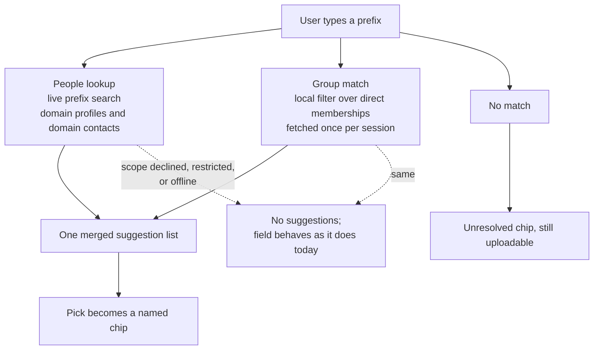
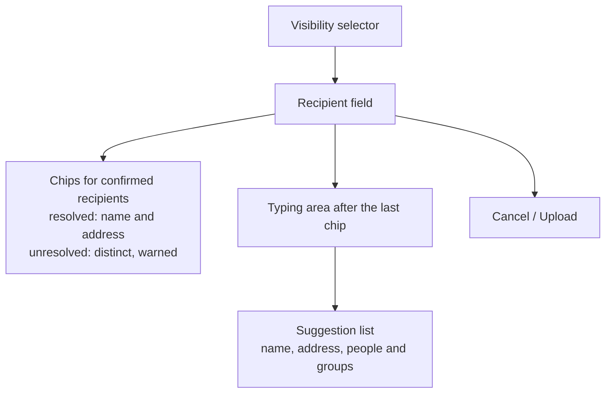
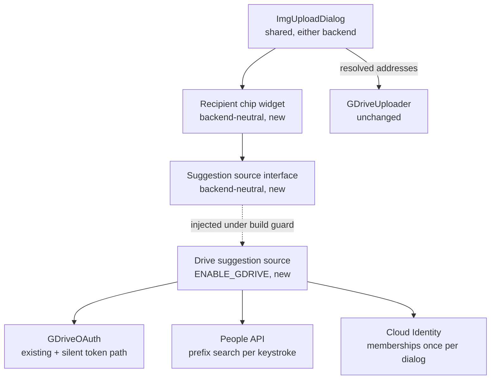
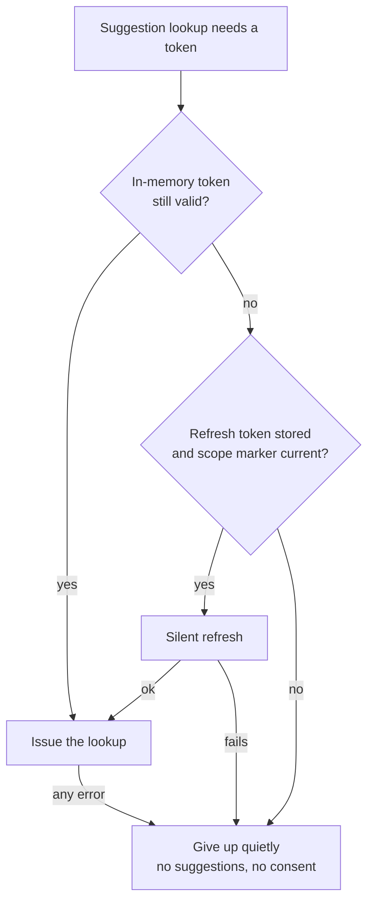

# Share Recipient Autocomplete - Plan

## Goal Capsule

- **Objective:** Let a user pick share recipients by typing a name, an email fragment, or a group name in the Drive upload dialog, resolving against the organization's directory instead of requiring an exact address typed from memory.
- **Product authority:** This plan owns recipient selection for the Google Drive "specific people" visibility level. The other three visibility levels, the Imgur backend, and the post-upload permission sequence are unchanged — the sequence keeps consuming a list of addresses, it just receives resolved ones.
- **Open blockers:** None. Both identity sources were confirmed against the tenant, and the coverage each one refused is recorded in Scope Boundaries.
- **Execution profile:** Feature work on `feat/gdrive-integration`, behind the existing `ENABLE_GDRIVE` build option. No migration, no rollout gate, no runtime configuration to add. The repository has no automated test harness, so behavioral proof is a guided walkthrough script run by a human against a real Workspace account (U6).
- **Stop conditions:** Surface instead of guessing if a directory or group lookup requires interactive consent to succeed (KTD1 exists to prevent exactly that), if widening the requested scope string re-prompts on every upload rather than once, or if adding the chip widget breaks the Imgur-only build (`build-baseline`).
- **Tail ownership:** This plan ends at a working feature on the branch with the walkthrough script passing and `docs/google-drive-setup.md` updated. Commit, push, and PR are not owned here.

---

## Product Contract

### Summary

Typing in the Drive share dialog's recipient field suggests real people from the organization's directory — by name, address prefix, or alias — alongside the groups the user belongs to. A picked suggestion becomes a chip carrying the recipient's name and address; anything typed that resolves to nobody becomes a visibly different chip and still uploads.

### Problem Frame

Sharing a capture with named colleagues today is a memory test. The field at `src/widgets/imguploaddialog.cpp:60-64` is a plain line edit labeled "Recipient emails (comma-separated):" — it knows nothing about the organization, so the user supplies every address in full.

Because almost nobody has colleagues' addresses memorized, the real workflow runs outside Flameshot: open Google Contacts, Gmail, or Chat, find each person, copy their address, return, paste, repeat. The tool is new enough in the organization that most shares go to someone the user has never shared with before, so this relay runs nearly every time rather than tapering off with familiarity.

Typed addresses fail in two ways, and the worse one is silent. A malformed address is dropped by the regex filter in `parseRecipients` (`src/widgets/imguploaddialog.cpp:125-142`) without ever being reported as dropped. A well-formed address for a person who does not exist survives validation, reaches Drive, and fails at the permission call — surfacing only afterward as "Could not share with %1." (`src/tools/imgupload/storages/gdrive/gdriveuploader.cpp:411-417`), by which point the file is already uploaded and the user believes the share went out.

The cost compounds beyond lost minutes. Daily friction in the sanctioned tool pushes people toward third-party screenshot services that sit outside the organization's trust boundary — the exact outcome the Drive backend was built to prevent.

### Key Decisions

- KD1. **Suggestions are looked up live; nothing about the organization is written to disk.** (session-settled: user-directed — chosen over syncing a local roster: keeps every name, address, and group off disk, beside a refresh token the Drive plan already treats as an exposure surface.) Governs R1, R2, R4.
- KD2. **Confirmed recipients render as chips, replacing the comma-separated text field.** (session-settled: user-directed — chosen over adding a completer popup to today's line edit: an unresolved address stays visually distinct from a resolved person.) Governs R5, R6.
- KD3. **Suggestions assist a share; they never gate one.** (session-settled: user-approved — the alternative, refusing to upload until every address resolves, would break sharing with external partners and with anything the directory cannot see.) Governs R6, R8, R11.
- KD4. **Groups come from the Cloud Identity Groups API, not the Admin SDK Directory API.** (session-settled: user-directed — the Directory API's Group resource requires the caller to hold an admin role, which ordinary users do not; Cloud Identity defines a non-admin authorization mode.) Governs R2.
- KD5. **Group suggestions cover the user's direct memberships only.** (session-settled: user-directed — the two wider options were each refused by the tenant: organization-wide search needs a customer identifier an ordinary user cannot obtain, and transitive membership search is gated to Workspace editions this organization does not hold.) Governs R2.
- KD6. **Both new scopes join the standard grant rather than being requested on first use.** (session-settled: user-directed — chosen over incremental consent: a browser consent round-trip landing in the moment right after a capture is worse than one re-consent at upgrade.) Governs R10.
- KD7. **Every chip carries the address alongside the name.** (session-settled: user-directed — chosen over showing the address only where two chips would collide: the organization's directory holds distinct people sharing a display name, so a name-only chip cannot be trusted to identify a recipient.) Governs R5.
- KD8. **The two sources are queried differently: people per keystroke, groups once per session.** The group call filters by member rather than by typed text, so it returns the user's whole membership list in one response and matching happens locally; only the people call is a live prefix search. Governs R1, R2.

The two identity sources and their degradation paths:

### Requirements

**Suggestion sources**

- R1. Typing in the recipient field suggests people from the organization's directory, prefix-matched against both display name and email address, covering domain profiles and domain shared contacts.
- R2. Suggestions include groups as well as people, covering the groups the signed-in user is a direct member of, matched on group name and address.
- R3. A person's alias matches its owner: typing someone's alternate address surfaces them, and picking the suggestion contributes the address the directory marks as primary rather than the alias that was typed.
- R4. No directory content is written to disk. Lookup results may be held in memory for the life of the process and are gone at exit.

**Recipient field behavior**

- R5. A confirmed recipient renders as a removable chip showing both the display name and the address, so two directory entries sharing a name are never indistinguishable; typing continues after the last chip.
- R6. An address that resolves to nobody becomes a chip that is visually distinct from a resolved one and is submitted with the upload unchanged.
- R7. An address can be entered by typing it in full without ever using a suggestion, so external partners and any address the directory cannot see remain shareable.
- R8. Suggestion lookup never delays or blocks the upload action: the user can confirm the dialog while a lookup is in flight, and whatever is in the field at that moment is what gets shared.
- R9. A recipient can be removed from the field after being added, before the upload is confirmed.

**Authorization and degradation**

- R10. The directory and group scopes are requested as part of the standard Drive grant, so an already-connected user re-consents exactly once and a newly-connected user consents once.
- R11. When directory lookup is unavailable — the scope was declined at the granular-consent screen, the tenant restricts directory or group visibility, or the machine is offline — the field accepts typed addresses exactly as it does today, with no error dialog and no blocked upload.
- R12. Recipient suggestion appears only where recipients are already collected: a build with the Drive backend active, with "Specific people by email" selected.

The field's regions, in the order the user meets them:

### Key Flows

- F1. Pick a colleague from the directory
  - **Trigger:** The user selects "Specific people by email" and types a name fragment.
  - **Steps:** Matching people and groups appear as suggestions; the user picks one; it collapses into a named chip; the user repeats or confirms the upload.
  - **Outcome:** The upload receives canonical addresses the user never typed in full.
  - **Covered by:** R1, R2, R3, R5

- F2. Enter an address the directory does not know
  - **Trigger:** The user types a full address that matches no suggestion — an external partner, or a typo.
  - **Steps:** The address becomes a visibly distinct chip carrying a not-in-your-organization warning; the user removes it or proceeds.
  - **Outcome:** The upload proceeds with the address as typed, and a mistake was visible before Upload rather than after.
  - **Covered by:** R6, R7, R9

- F3. Share when lookup is unavailable
  - **Trigger:** The user reaches the recipient field with the directory scope declined, tenant visibility restricted, or no network.
  - **Steps:** No suggestions appear; the user types addresses in full; each becomes an unresolved chip.
  - **Outcome:** The share completes exactly as it does today, with nothing presented as broken.
  - **Covered by:** R8, R11

### Acceptance Examples

- AE1. **Covers R1.** **Given** the user has granted the directory scope, **When** they type the first letters of a colleague's surname, **Then** that colleague appears as a suggestion showing their name and address.
- AE2. **Covers R1.** **Given** the user types the first letters of an address rather than a name, **When** matches exist, **Then** the same people appear — the prefix matches either field.
- AE3. **Covers R2.** **Given** the user types the first letters of a team name, **When** they belong to a group matching it, **Then** the group appears as a suggestion alongside people.
- AE4. **Covers R2, R7.** **Given** the user types the name or alias of a group that is not among their direct memberships, **When** no suggestion matches, **Then** typing the group's address in full still shares to the group.
- AE5. **Covers R3.** **Given** a colleague has an alternate address, **When** the user types that alternate, **Then** the colleague appears and picking them contributes their primary address rather than the alias typed.
- AE6. **Covers R6.** **Given** the user types a misspelled address that is syntactically valid, **When** it resolves to nobody, **Then** it appears as a distinct chip carrying a warning, and Upload remains available.
- AE7. **Covers R8.** **Given** a lookup is in flight, **When** the user confirms the upload, **Then** the upload proceeds immediately with the recipients currently in the field.
- AE8. **Covers R10.** **Given** a user connected Drive before this change shipped, **When** they next upload, **Then** they are asked to consent once to the widened scope set and are not asked again on subsequent uploads.
- AE9. **Covers R11.** **Given** the user declined the directory scope at the granular-consent screen, **When** they open the recipient field, **Then** no suggestions appear, no error dialog is raised, and typed addresses upload normally.
- AE10. **Covers R4.** **Given** the user has looked up several colleagues, **When** Flameshot exits and restarts, **Then** no directory content from the previous session is present and no recipient history is offered.
- AE11. **Covers R5.** **Given** two directory entries share a display name, **When** the user adds both as recipients, **Then** the two chips are distinguishable from each other without further interaction.

### Success Criteria

- Sharing a capture with named colleagues requires no visit to Contacts, Gmail, or Chat.
- An address that will fail at the permission call is visible as suspect before the upload is confirmed, not reported after it.
- A user whose tenant or consent choices block directory lookup is no worse off than today.

### Scope Boundaries

- Nothing is remembered between sessions. There is no recent-recipients list — the shares that hurt are to people the user has never sent to before, so a history would miss the case that motivated this work.
- The three other visibility levels are untouched. Only "Specific people by email" gains recipient suggestion.
- Recipient suggestion does not change how permissions are applied. The uploader keeps its per-recipient user-then-group retry (`src/tools/imgupload/storages/gdrive/gdriveuploader.cpp:396-422`); resolving addresses earlier does not remove the need for it, since typed addresses still arrive unresolved.
- No membership expansion. Picking a group shares to the group, and the field does not enumerate or display who is in it.
- No profile photos in suggestions. Fetching per-person images would add requests and a caching question for no help in identifying the right person.
- Three kinds of group are not suggested, all of them still shareable by typing the address through the uploader's existing group retry: groups the user does not belong to, groups reached only through another group, and any group referred to by an alias rather than its primary address.
- Multi-domain organization-link sharing is not addressed. The tenant spans more than one domain, while the "anyone in your organization with the link" level derives a single domain from the signed-in account (`src/tools/imgupload/storages/gdrive/gdriveuploader.cpp:327-351`), so that level currently reaches one domain and not the others. Real, but a separate concern from recipient selection.

### Dependencies / Assumptions

- The People API and the Cloud Identity API must be enabled on the same Cloud project that already carries the Drive API for this OAuth client.
- Directory visibility depends on Workspace admin settings. If the tenant restricts directory contact sharing or group visibility, lookup returns nothing and R11's path is the shipped behavior for those users.
- `directory.readonly` is a sensitive scope. This is assumed acceptable because the OAuth application is registered internally to the organization rather than published, but it has not been confirmed against the organization's app-access policy.
- The existing consent machinery is assumed to absorb a wider scope set without change: the grant marker at `src/tools/imgupload/storages/gdrive/gdriveoauth.cpp:157-164` re-consents exactly once when the requested scope string differs from the stored one, and the granular-consent handling at `:393` already tolerates a partially granted grant.
- Sharing to a group already works when a group address is typed; only suggesting groups is new.
- Confirmed against the tenant: domain profiles return a user's alternate addresses alongside the primary, each marked verified, with the canonical one carrying a primary marker. R3's rule for which address a chip contributes rests on that marker.
- Confirmed against the tenant: a prefix query on an alternate address returns its owner, so alias support is a matching capability and not only a display one. R3 needs no fallback.
- Confirmed against the tenant: distinct directory profiles can share a display name. R5's chip content assumes this is normal rather than exceptional.
- Confirmed against the tenant: an organization-wide Cloud Identity group search is rejected without a customer identifier, and an ordinary user cannot obtain that identifier without asking an administrator.
- Confirmed against the tenant: a non-admin can read their own direct group memberships, receiving each group's display name, primary address, and description. Transitive membership search is refused for this organization's Workspace edition. Together these narrowed R2 to direct memberships.
- Confirmed against the tenant: a membership response carries one address per group and no alias keys, which is why R3 covers people only.

### Sources / Research

- Current recipient entry and its silent-drop validation: `src/widgets/imguploaddialog.cpp:60-77` (field construction and visibility gating), `:96-107` (empty-recipient guard), `:125-142` (`parseRecipients`).
- Post-upload permission application, including the user-then-group retry and the after-the-fact failure message: `src/tools/imgupload/storages/gdrive/gdriveuploader.cpp:364-422`.
- Current OAuth scope set (`drive.file openid email`), the single-re-consent grant marker, and granular-consent handling: `src/tools/imgupload/storages/gdrive/gdriveoauth.cpp:36-37`, `:157-164`, `:376-378`, `:393`.
- Prior decisions this builds on — least-privilege scope, per-upload visibility, the config file as an exposure surface: `docs/plans/2026-07-24-001-feat-google-drive-upload-plan.md`.
- People API directory search: prefix matching over person fields, `DIRECTORY_SOURCE_TYPE_DOMAIN_PROFILE` and `DIRECTORY_SOURCE_TYPE_DOMAIN_CONTACT` sources, `directory.readonly` scope — https://developers.google.com/people/api/rest/v1/people/searchDirectoryPeople and https://developers.google.com/people/v1/directory
- Admin SDK Directory API Group resource, carrying the admin-role requirement that rules it out for ordinary users — https://developers.google.com/workspace/admin/directory/v1/reference/groups
- Cloud Identity Groups API non-admin authorization mode — https://docs.cloud.google.com/identity/docs/groups and https://docs.cloud.google.com/identity/docs/concepts/auth
- Cloud Identity direct-membership search, the call R2 rests on: `member_key_id` predicate alone, `cloud-identity.groups.readonly` scope, no edition restriction — https://docs.cloud.google.com/identity/docs/reference/rest/v1/groups.memberships/searchDirectGroups
- Cloud Identity transitive-membership search and its edition restriction, which is why R2 stops at direct memberships — https://docs.cloud.google.com/identity/docs/reference/rest/v1/groups.memberships/searchTransitiveGroups
- Qt's completion mechanism for a custom widget: `QCompleter` in unfiltered-popup mode over a replaceable list model, attached with `setWidget()` and shown with `complete()` — https://doc.qt.io/qt-6/qcompleter.html
- Backend resolution must go through the shared resolver, not the raw config key: `docs/solutions/logic-errors/gdrive-visibility-ui-missing-on-drive-only-builds.md`.
- Config writes are deferred, so any write-then-tighten-permissions sequence must flush between the two: `docs/solutions/security-issues/qsettings-deferred-write-defeats-permission-chmod.md`.

---

## Planning Contract

**Product Contract preservation:** unchanged. The five Deferred-to-Planning questions are answered by KTD5 through KTD9 and removed from Outstanding Questions rather than left standing as open.

### Key Technical Decisions

- KTD1. **Suggestion lookups use a refresh-only token path that can never start interactive consent.** `requestAccessToken()` falls through to `startConsentFlow()` when no usable refresh token exists (`src/tools/imgupload/storages/gdrive/gdriveoauth.cpp:141-169`), which would open a browser window while the user is typing. The dialog is constructed before the upload that would otherwise warm the token (`src/core/flameshot.cpp:569`), so without a silent path the first capture of every session either has no suggestions or pops consent mid-share. Governs R8, R11.
- KTD2. **Lookup availability is discovered by attempting the call, not by recording which scopes Google granted.** The token response's `scope` field is not read today — only the requested set is stored (`gdriveoauth.cpp:376-378`) — and adding a second marker would create a new source of truth to keep correct. Treating any lookup failure as "no suggestions" collapses declined consent, tenant restriction, and offline into one path. Governs R11.
- KTD3. **Widening the grant is a one-line change to the requested scope string.** The marker comparison at `gdriveoauth.cpp:157-164` already re-consents exactly once when the requested string differs from the stored one, so no new consent machinery is needed. Governs R10.
- KTD4. **The chip widget is backend-neutral and the Drive suggestion source is injected behind the build guard.** `src/widgets/CMakeLists.txt` compiles the upload dialog whenever either backend is enabled, so a Drive-only type referenced unconditionally breaks the Imgur-only build. The widget takes an abstract suggestion source; only the include and the construction site are guarded, mirroring how the uploader manager guards its Imgur backend. Governs R5, R12.
- KTD5. **The group list is fetched once per process and outlives the dialog; people are searched per keystroke.** Instantiates KD8. A dialog is constructed per capture, so a dialog-scoped cache would re-fetch on every screenshot; the list therefore lives beside the app-lifetime OAuth service and is dropped when the account is disconnected or changes, so a stale list can never be offered for the wrong account. Governs R1, R2, R4.
- KTD6. **Suggestions list locally-matched groups first, then people, with people collapsed by directory identity.** Groups resolve without a round trip, so ordering them first keeps rows from reordering under the cursor when the network reply lands. A person matching on both name and alias is one directory entry and appears once. Governs R1, R2, R3.
- KTD7. **People search fires after a short typing pause and a two-character minimum, cancelling any in-flight request.** Bounds request volume in a dialog that opens after every capture, and prevents a stale reply overwriting a newer one. Governs R1, R8.
- KTD8. **Enter, Tab, comma, and semicolon commit the typed text as a chip; Backspace in an empty input removes the last chip.** Comma and semicolon preserve the separators today's field already accepts (`src/widgets/imguploaddialog.cpp:127`), so paste-a-list keeps working. Governs R5, R9.
- KTD9. **Suggestion rows and chips carry name and address only.** The group description the membership response also returns is dropped — it adds width without helping identify the right recipient. Governs R2, R5.
- KTD10. **The dialog's public API is unchanged.** `selectedVisibility()` and `recipients()` keep their signatures and the chip field replaces the line edit behind them, so the single call site in `src/core/flameshot.cpp` and the uploader's recipient handling are untouched. Governs R12.
- KTD11. **Directory content and typed prefixes never reach logs.** The OAuth service already holds this line for codes, tokens, and verifiers (`src/tools/imgupload/storages/gdrive/gdriveoauth.h:33`); suggestions introduce colleagues' names and addresses plus whatever the user types, which is the same class of data and gets the same rule. Governs R4.

### High-Level Technical Design

Where the new pieces sit against what exists:

Token acquisition, which is the part most likely to go wrong:

The upload path keeps its own separate call to the consenting entry point; only the suggestion path is restricted to the silent one.

### Sequencing

U1 through U3 build the data side and can land before any UI change. U4 is independent of them and can proceed in parallel. U5 needs U2, U3, and U4. U6 needs U5. U7 is independent of all of them.

### System-Wide Impact

- **Consent surface.** Every already-connected user meets one re-consent prompt on their next upload (R10). Users who decline the added scopes keep working uploads with no suggestions (R11).
- **Build flavors.** Four configurations exist at the repo root and all four must keep building; `build-baseline` is the one that catches a Drive type leaking into shared code.
- **Setup burden.** Two additional Google APIs must be enabled on the OAuth client's project before suggestions work anywhere, which is a packaging and onboarding change, not just a code change (U7).
- **A new piece of process-lifetime state.** The cached group list joins the OAuth service as something that survives individual captures, so it inherits the same account-change and disconnect obligations (KTD5).
- **A new class of data in memory.** Colleagues' names and addresses now pass through the app, which extends the never-log rule that previously covered only credentials (KTD11).

### Risks & Dependencies

- **A suggestion lookup accidentally triggering consent** would put a browser window in front of a user mid-share. KTD1 is the mitigation; U1's walkthrough case is the proof.
- **Re-consent looping.** If the stored marker and the requested string disagree on every startup, users are re-prompted forever. The existing comparison is exact-string, so the new scope string must be written in one place and read in both.
- **A stale reply landing after a newer one** would show suggestions for a prefix the user has moved past. KTD7's cancellation is the mitigation.
- **Backend-resolution drift.** A recorded defect in this subsystem came from a second code path re-deriving "is Drive active?" from raw config instead of the shared resolver. Any new gating must call `ImgUploaderManager::uploaderPlugin()`.
- **A cached group list outliving its account** would offer the previous user's teams after an account switch. KTD5's invalidation is the mitigation; U3's walkthrough case is the proof.
- **Directory data reaching a log or a crash dump** would leak colleagues' addresses from a tool whose whole premise is staying inside the org's trust boundary. KTD11 is the mitigation.
- **Upstream dependency.** Suggestions depend on Workspace directory and group visibility settings that this project does not control; when they are restricted, R11's path is the shipped behavior.

---

## Implementation Units

This repository has no automated test harness, so no unit names a test source file. Every test scenario below is a case that accumulates in the single guided walkthrough script authored in U6; a unit is not proven until its cases are in that script and an operator has recorded PASS.

### U1. Widen the OAuth grant and add a silent token path

- **Goal:** The app requests the directory and group scopes, re-consents once, and can obtain a token for suggestions without ever opening a consent window.
- **Requirements:** R10, R11; KTD1, KTD3
- **Dependencies:** none
- **Files:** `src/tools/imgupload/storages/gdrive/gdriveoauth.h`, `src/tools/imgupload/storages/gdrive/gdriveoauth.cpp`
- **Approach:**
  1. Add `https://www.googleapis.com/auth/directory.readonly` and `https://www.googleapis.com/auth/cloud-identity.groups.readonly` to the single requested-scope constant.
  2. Add a silent entry point that returns the in-memory token when valid, refreshes from the stored refresh token when the marker matches, and reports failure otherwise. It must not reach `startConsentFlow()` on any branch.
  3. Leave `requestAccessToken()` and the upload path unchanged.
- **Patterns to follow:** the existing marker comparison and refresh path in `gdriveoauth.cpp:141-169`; per-request reply connections with an explicit transfer timeout, as the rest of this file already does.
- **Test scenarios:**
  - Covers AE8. A build carrying a refresh token from the previous scope set prompts for consent exactly once on the next upload, then stops prompting.
  - A fresh install consents once and never re-prompts on subsequent uploads.
  - With a valid stored refresh token and no in-memory token, the silent path yields a token and no browser window opens.
  - With no stored refresh token, the silent path fails and no browser window opens.
  - Declining the added scopes at the granular consent screen still leaves uploads working.
- **Verification:** All four build flavors compile. A walkthrough confirms one re-consent and no consent window from the silent path.

### U2. Directory people lookup

- **Goal:** A prefix returns matching people from the org directory with their names, primary address, and any alternates.
- **Requirements:** R1, R3, R4; KTD2, KTD7
- **Dependencies:** U1
- **Files:** `src/tools/imgupload/storages/gdrive/gdrivedirectory.h`, `src/tools/imgupload/storages/gdrive/gdrivedirectory.cpp`, `src/tools/CMakeLists.txt`
- **Approach:**
  1. Add the new sources to the `ENABLE_GDRIVE` block in `src/tools/CMakeLists.txt`.
  2. Query the People API directory search over domain profiles and domain shared contacts, reading names and email addresses.
  3. Identify the contributed address by the primary marker on the address entry; keep alternates for display only.
  4. Debounce, enforce the two-character minimum, and abort the previous reply before issuing a new one, per KTD7.
  5. Hold results in memory only, per R4; report every failure as an empty result rather than an error, per KTD2.
- **Patterns to follow:** `src/tools/imgupload/storages/gdrive/gdriveuploader.cpp` for per-reply signal connections, JSON parsing, and transfer timeouts — not a single shared `finished` hookup.
- **Test scenarios:**
  - Covers AE1. A surname prefix returns the matching colleague with name and address.
  - Covers AE2. An address prefix returns the same people as the name prefix.
  - Covers AE5. An alias prefix returns its owner, and the contributed address is the primary one.
  - A one-character prefix issues no request.
  - Typing onward while a request is in flight abandons the earlier reply, and the older result never replaces the newer one.
  - A revoked or insufficient grant returns no suggestions and raises no dialog.
- **Verification:** Walkthrough against a real Workspace account, including a colleague known to have an alias.

### U3. Group membership lookup

- **Goal:** The user's direct group memberships are available for local matching.
- **Requirements:** R2; KTD5
- **Dependencies:** U1, U2
- **Files:** `src/tools/imgupload/storages/gdrive/gdrivedirectory.h`, `src/tools/imgupload/storages/gdrive/gdrivedirectory.cpp`
- **Approach:**
  1. Query Cloud Identity direct-group search for the signed-in account, filtering by member only — adding the label clause returns 400 on this endpoint.
  2. Read each result's display name and group address; ignore the description, per KTD9.
  3. Hold the list in a process-lifetime cache fetched on first need and matched locally thereafter, and drop it on disconnect or account change, per KTD5.
  4. Treat a refusal as an empty group list, leaving people suggestions unaffected.
- **Patterns to follow:** same request and parsing shape as U2; app-lifetime service ownership as in `src/tools/imgupload/storages/gdrive/gdriveoauth.h`.
- **Test scenarios:**
  - Covers AE3. A team-name prefix surfaces a group the user belongs to, listed alongside people.
  - Covers AE4. A group the user does not belong to produces no suggestion, and typing its address in full still shares to it.
  - Matching a group by its address prefix works as well as by its name.
  - A tenant that refuses the group call still returns people suggestions.
  - Two captures in one session issue the group call once, not twice.
  - Disconnecting the account and connecting a different one offers the second account's groups, never the first's.
- **Verification:** Walkthrough against an account with at least two group memberships.

### U4. Recipient chip widget

- **Goal:** A reusable field where confirmed recipients are removable chips and unresolved entries are visibly distinct, backed by an abstract suggestion source.
- **Requirements:** R5, R6, R7, R9; KTD4, KTD8, KTD9
- **Dependencies:** none
- **Files:** `src/widgets/recipientchipedit.h`, `src/widgets/recipientchipedit.cpp`, `src/widgets/CMakeLists.txt`
- **Approach:**
  1. Add the sources to the `ENABLE_IMGUR OR ENABLE_GDRIVE` blocks in `src/widgets/CMakeLists.txt` so the widget compiles wherever the dialog does, per KTD4.
  2. Define the suggestion-source interface the widget consumes; the widget itself knows nothing about Google.
  3. Render confirmed recipients as removable chips carrying name and address, with a distinct treatment and warning for an entry that matched nothing.
  4. Drive the popup with `QCompleter` in unfiltered-popup mode over a replaceable list model — the source already prefix-filtered, so the completer must not filter again. Attach with `setWidget()` since this is a custom widget.
  5. Implement commit and removal keys per KTD8, and expose the committed addresses as a string list.
- **Patterns to follow:** existing hand-built widgets in `src/widgets/` for layout and ownership conventions; no `.ui` file, matching how the upload dialog is constructed in code.
- **Test scenarios:**
  - Covers AE6. A syntactically valid address matching nobody becomes a distinct warned chip, and the accept button stays available.
  - Covers AE11. Two entries sharing a display name produce chips that are distinguishable without further interaction.
  - Each commit key produces a chip; pasting a comma-separated list produces one chip per address.
  - Backspace in an empty input removes the last chip; a chip's remove affordance removes that chip.
  - With a suggestion source that returns nothing, the field still accepts typed addresses.
  - Committed addresses come back in entry order with no duplicates.
- **Verification:** Compiles in all four flavors, including the two with `ENABLE_GDRIVE=OFF`. Walkthrough covers the keyboard cases.

### U5. Replace the recipient line edit in the upload dialog

- **Goal:** The Drive "specific people" level collects recipients through the chip field, wired to the Drive suggestion source.
- **Requirements:** R5, R12; F1, F2, F3; KTD4, KTD6, KTD10 — this unit is where all three Key Flows become reachable
- **Dependencies:** U2, U3, U4
- **Files:** `src/widgets/imguploaddialog.h`, `src/widgets/imguploaddialog.cpp`
- **Approach:**
  1. Replace the `QLineEdit` member with the chip widget, keeping the label and the show/hide behavior tied to the visibility selector.
  2. Guard only the Drive suggestion source's include and construction under `ENABLE_GDRIVE`; leave everything else runtime-conditional as the dialog already is.
  3. Order suggestions groups-then-people and collapse duplicate people, per KTD6.
  4. Keep `selectedVisibility()` and `recipients()` signatures unchanged, per KTD10; keep `parseRecipients()` as the validator for typed text before it becomes a chip.
  5. Keep the empty-recipient guard so accepting with no recipients still refuses.
- **Patterns to follow:** resolve backend activity through `ImgUploaderManager::uploaderPlugin()`, never the raw `uploadStorage` key — see `docs/solutions/logic-errors/gdrive-visibility-ui-missing-on-drive-only-builds.md`.
- **Test scenarios:**
  - Covers AE7. Accepting the dialog while a lookup is in flight uploads immediately with whatever recipients are present.
  - Covers AE9. With the added scopes declined, the field shows no suggestions, raises no dialog, and typed addresses upload normally.
  - Switching the visibility selector away from "specific people" and back preserves nothing stale in the field.
  - Accepting with an empty field still refuses, as it does today.
  - On a Drive-only build the field appears; on an Imgur-only build the Drive controls stay absent.
  - Recipients reaching the uploader are the resolved primary addresses, not display names.
- **Verification:** All four flavors compile; walkthrough confirms the dialog behaves as before for every path that does not involve suggestions.

### U6. Guided walkthrough script

- **Goal:** A human-runnable script that exercises every acceptance example against a real Workspace account.
- **Requirements:** all; proves AE1 through AE11
- **Dependencies:** U5
- **Files:** `tests/gdrive_recipient_autocomplete.sh`
- **Approach:**
  1. Follow the existing walkthrough shape: takes the executable path, states prerequisites, prints the expectation before each case, and has the operator record PASS or FAIL.
  2. Group cases as people suggestions, group suggestions, unresolved entries, degradation, and consent.
  3. State the account prerequisites explicitly — a colleague with an alias, two entries sharing a display name, at least two group memberships, and a group the user does not belong to.
- **Patterns to follow:** `tests/gdrive_account_identity.sh` for structure, prerequisites block, and per-case expectation wording.
- **Test scenarios:** `Test expectation: none -- this unit is the test.`
- **Verification:** The script runs end to end and every case has a stated expectation an operator can judge without reading code.

### U7. Update the Google Drive setup guide

- **Goal:** Operators enable the right APIs and scopes, and the guide stops claiming the requested scopes are all non-sensitive.
- **Requirements:** R10
- **Dependencies:** none
- **Files:** `docs/google-drive-setup.md`
- **Approach:**
  1. Add the People API and Cloud Identity API to the enable-these-APIs step.
  2. Add the two new scopes to the scope list, and correct the non-sensitive claim — the directory scope is sensitive, which is acceptable for an internally-registered app but is not the same statement.
  3. Add an upgrade note for the one-time re-consent, following the existing sign-in-scopes upgrade section.
  4. State the coverage limits an operator would otherwise report as bugs: no group suggestions beyond direct memberships, and no group aliases.
- **Patterns to follow:** the existing "Upgrading from a build before the sign-in scopes" section.
- **Test scenarios:** `Test expectation: none -- documentation only.`
- **Verification:** A reader following the guide from scratch can enable everything the feature needs without consulting the code.

---

## Verification Contract

| Gate | Command or action | Applies to |
|---|---|---|
| Drive-only build | `cmake --build build-gdrive --target flameshot` | U1-U7 |
| Imgur-only build | `cmake --build build-baseline --target flameshot` | U4, U5 — proves no Drive type leaked into shared code |
| Both backends | `cmake --build build-both --target flameshot` | U4, U5 |
| Neither backend | `cmake --build build-off --target flameshot` | U4, U5 — proves nothing reaches a default build |
| Formatting | `clang-format` per `.clang-format`; `clang-tidy` per `.clang-tidy` | all units touching C++ |
| Behavioral proof | `tests/gdrive_recipient_autocomplete.sh <path-to-flameshot>` | U6, against a real Workspace account |
| Regression proof | `tests/gdrive_account_identity.sh <path-to-flameshot>` | U1 — the scope change touches the account-identity path |

The repository has no automated test harness. Every behavioral gate above is a human-run walkthrough, and "tests pass" means an operator recorded PASS for each case.

---

## Definition of Done

**Global**

- All four build flavors compile clean.
- Typing a name, address prefix, or alias in the Drive "specific people" field suggests real people; typing a team name suggests groups the user belongs to.
- No code path in the suggestion flow can open a consent window.
- With the added scopes declined, or offline, the field behaves as it does today and raises no error dialog.
- Nothing about the organization is written to disk, and no directory content or typed prefix appears in any log.
- A second capture in the same session reuses the cached group list; switching accounts drops it.
- `tests/gdrive_recipient_autocomplete.sh` passes every case, and `tests/gdrive_account_identity.sh` still passes.
- `docs/google-drive-setup.md` reflects the new APIs, scopes, re-consent, and coverage limits.
- Abandoned or experimental code from approaches that did not work out is removed, not left in the diff.

**Per unit**

- U1: one re-consent, then none; the silent path never reaches the consent flow.
- U2: name, address, and alias prefixes each return the right person; the contributed address is the primary one.
- U3: direct memberships suggest; a refused group call leaves people suggestions working; the list survives one capture and dies with the account.
- U4: chips carry name and address; unresolved entries are visibly distinct and still submit; the widget compiles with Drive off.
- U5: the dialog's public API is unchanged and every non-suggestion path behaves as before.
- U6: every acceptance example has a walkthrough case with a stated expectation.
- U7: an operator can set the feature up from the guide alone.
