Color Widgets Gallery
=====================

Color2DSlider
-------------
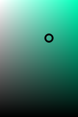

This widget allow the user to select 2 HSV color components at the same time,
by default that is Saturation and Value but they can be changed.

ColorDialog
-----------
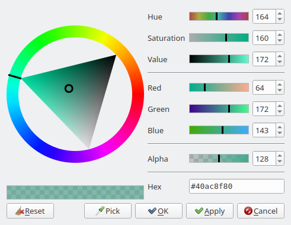

This is a dialog analogous to <tt>QColorDialog</tt> but with a much nicer and friendlier 
user interface. It uses several of the other widgets.

ColorLineEdit
-------------
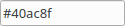
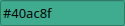

This is a <tt>QLineEdit</tt> intended to be used to edit and display color names.
It accepts several string formats:
* <tt>#f00</tt> (3 hexadecimal rgb digits)
* <tt>#ff0000</tt> (6 hexadecimal rgb digits)
* <tt>rgb(255,0,0)</tt> (function-like)
* <tt>red</tt> (color name)

It can optionally display the color it represents on its background.

ColorListWidget
---------------
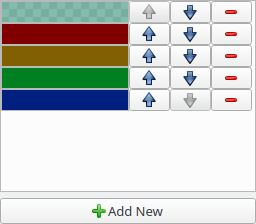

It allows to display and edit a list of colors.

ColorPaletteWidget and Swatch
-----------------------------
These widgets handle color palettes.

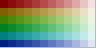

**Swatch** only handles a single palette, can be used to just select colors from the 
palette or to modify the palette via drag and drop operations.

**ColorPaletteModel** is a list model that represents palettes with can be used
with the Qt item view widgets, it provides a name and a preview icon for
each of the stored palettes.
It also has functionality to load and save palettes from the filesystem.

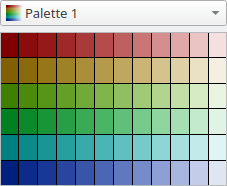
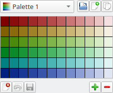

**ColorPaletteWidget** manages a list of palettes (via **ColorPaletteModel**).
Has two modes: read-only only allows to select palettes and colors,
otherwise it can be used to modify the list of palettes and the palette itself.

ColorPreview and ColorSelector
------------------------------

**ColorPreview** is a widget that displays a color or compares two colors.

**ColorSelector** is like **ColorPreview** but when clicked it shows a ColorDialog.

GradientSlider and HueSlider
----------------------------
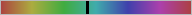

**GradientSlider** is a <tt>QSlider</tt> which uses a gradient as its background.

**HueSlider** is specifically made to select a hue and has more information
about the represented color.

GradientEditor
--------------
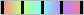

**GradientEditor** is similar in appearance to **GradientSlider** but it's for editing the gradient.

GradientListModel and GradientDelegate
--------------------------------------

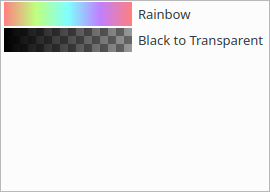

**GradientListModel** is a <tt>QAbstractListModel</tt> used to list gradients (useful for combo boxes, item views and the like).

**GradientDelegate** is an item delegate to edit gradients in an item view.
