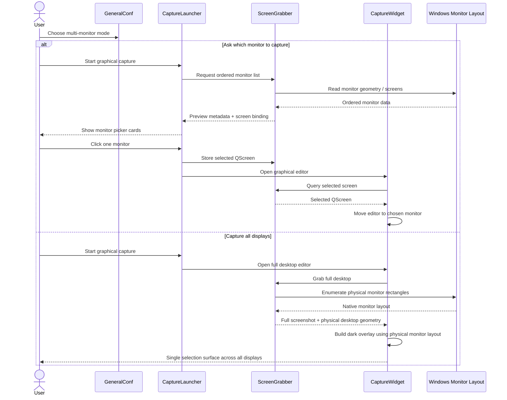

# Release Notes

## Windows multi-monitor capture

This change set fixes the Windows graphical capture flow when Flameshot is used with multiple monitors, especially when monitors have different resolutions, aspect ratios, or DPI scaling.

### Problem summary

There were two distinct failure modes:

1. `Capture all displays`
   The darkened overlay and selection surface could become distorted or offset because the desktop was being composed from Qt logical screen geometry instead of the physical monitor layout reported by Windows.

2. `Ask which monitor to capture`
   The monitor picker could show previews in the wrong order, bind the wrong monitor to a preview card, or always open the editing overlay on the left-most monitor regardless of the user's choice.

### What was implemented

#### 1. New Windows configuration option

A Windows-only setting was added to let the user choose how graphical capture behaves on multi-monitor setups:

- `Ask which monitor to capture`
- `Capture all displays`

Affected areas:

- `src/config/generalconf.cpp`
- `src/config/generalconf.h`
- `src/utils/confighandler.cpp`
- `src/utils/confighandler.h`
- `src/core/capturerequest.cpp`
- `src/core/capturerequest.h`

#### 2. Physical desktop composition for `Capture all displays`

The full-desktop graphical overlay now uses the physical monitor layout from Windows instead of relying only on Qt logical geometry.

This fixes cases where one monitor looked stretched, shifted, or partially darkened when monitors had different size or DPI settings.

Affected areas:

- `src/utils/screengrabber.cpp`
- `src/utils/screengrabber.h`
- `src/widgets/capture/capturewidget.cpp`

Implementation highlights:

- Enumerate native Windows monitor rectangles.
- Build the full desktop screenshot using those physical rectangles.
- Position the graphical overlay using the same physical desktop geometry.
- Reuse those same rectangles for selection and painting logic.

#### 3. Stable monitor mapping for the legacy picker

The legacy picker path was corrected so the same monitor identity is used consistently across:

- preview generation
- on-screen ordering
- selected monitor storage
- the final editor window position

Affected areas:

- `src/widgets/capturelauncher.cpp`
- `src/utils/monitorpreview.cpp`
- `src/utils/monitorpreview.h`
- `src/utils/screengrabber.cpp`
- `src/widgets/capture/capturewidget.cpp`

Implementation highlights:

- Use a stable ordered monitor list for preview cards.
- Bind each card to the actual `QScreen*` it represents.
- Keep the selected `QScreen*` through the whole flow instead of recalculating from a loosely related index later.
- Use the selected screen when opening the editing overlay so it opens on the chosen monitor rather than defaulting to the left-most desktop origin.

### Sequence diagram

### Result

On Windows:

- `Capture all displays` now respects the real monitor layout and no longer distorts the darkened overlay on mixed monitor setups.
- `Ask which monitor to capture` now preserves correct preview order and opens the editor on the monitor actually selected by the user.

### Notes about platform scope

This work is primarily Windows-specific. The sensitive runtime changes are isolated to the Windows capture path, while Linux and macOS continue using their existing platform-specific behavior.
